# Cluster

---
## Desarrollado para [Laboratoria](https://www.laboratoria.la/)

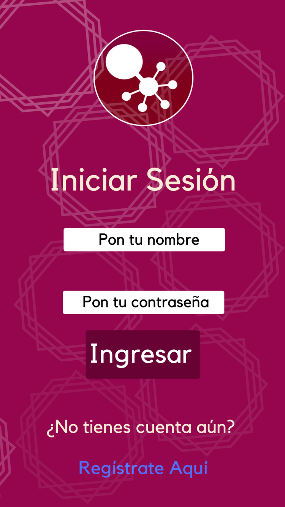

## Introducción   :busts_in_silhouette:

**Cluster** es una nueva red social enfocada a las mujeres interesadas en las CTIM (Ciencias, Tecnología, Ingenierías y Matemáticas). Esta red surge como respuesta a la poca visibilidad de las mujeres en las ciencias y la necesidad de difundir las ciencias en las niñas y jóvenes.

**Cluster**, que en inglés significa “grupo”, refleja el valor central de esta red social: hacer grupos de apoyos para mujeres que trabajan y están interesadas en las CTIM; otro de los motivos por la que se eligió esta palabra para nombrar a nuestra red social reside en que dicha palabra se usa con mucha frecuencia dentro del universo de las CTIM.

Siguiendo con el mismo pensamiento, nuestro logo consta de dos “grupos” que se unen y uno de ellos tiene pequeños subgrupos. Con este logo queremos dar a entender que en esta red social habrá una gran red de apoyo no solo dentro del grupo predilecto de la usuaria, sino que además en otros y que nunca se sentirá sola.

## Motivaciones   :mortar_board:

Actualmente en el mundo de las CTIM las mujeres siguen siendo una minoría, por ejemplo, constituyen sólo un 30% de los investigadores en el mundo. Sin ir más lejos, las mujeres en México ocupan el 1% en las carreras de ingenierías en cómputo.

Según la investigación de Microsoft *"Closing The STEM Gap”* hecha en 2017, encontró varios puntos por los cuales las mujeres deciden alejarse de las ciencias:

Las mujeres pierden el interés por carreras relacionadas con las CTIM cuando crecen, por ejemplo, al 31% de las niñas de escuela primaria encuestadas les atrae la programación, pero al momento que ingresan a la universidad el porcentaje desciende a casi el 20%.

También se llegó a la conclusión que la mayoría de las mujeres perciben las carreras CTIM como poco creativas y aburridas.

Para combatir la brecha de género en las CTIM  este estudio propone varios puntos, por ejemplo:

- Apoyar actividades extracurriculares relacionadas con las CTIM
- Modelos femeninos a seguir visibles para las niñas
- Proporcionar experiencias prácticas y ejemplos del mundo real.
- Demostrar el impacto que tienen los trabajos de STEM en el mundo.
- Enfatizar los aspectos creativos de las ingenierías y la informática.
- Alentar a padres, maestros y otros influyentes en la vida de una niña a apoyar y fomentar el interés en este campo de estudio.
- Apoyar a maestros para que desarrollen estrategias para involucrar a las chicas que tienen miedo de hacer preguntas o que necesitan ayuda vocacional relacionadas con carreras STEM.

El equipo de trabajo se preguntó ¿y si hubiera un lugar donde todos los puntos anteriores se congregarán? Y así nació **Cluster** una herramienta que ayudará a acortar la brecha de género, creando una red de apoyo para estas mujeres interesadas en las CTIM.

Aquí encontrarán de una manera rápida y al alcance de su celular apoyo entre ellas, discusiones constructivas e influenciar positivamente a las jóvenes que estén pensando desarrollarse en este mundo, pero que por ciertas circunstancias aún no toman esa decisión.

## Construyendo Estatus   :books:

A lo largo del proyecto se han hecho varias mejoras: el 18 de julio se hizo **Cluster v.1** donde la usuaria se podía loguear por medio de su correo electrónico y podía hacer comentarios sencillos.

Para el 25 de junio se entregó **Cluster v.2** donde se añadió que la usuaria se pudiera loguear por medio de su cuenta de Google y de Facebook, y poder hacer comentarios y borrar dichos comentarios, así como ver comentarios de otras personas.

Por último, el 1 de agosto se pretende entregar **Cluster v.3**, una plataforma donde el usuario pueda ver su perfil, editar su comentario, borrarlo y darle «me gusta» a su propio comentario como al de otros usuarios.
  
## Features   :microscope:

Se hicieron 2 encuestas para conocer un poco más al público al que iría enfocado **Cluster** y así tomar decisiones pensando primeramente en nuestras futuras usuarias.

Nosotras diseñamos la plataforma priorizando que las usuarias pudieran compartir sus estados e imágenes, en segundo lugar que pudieran mandar mensajes privado y en tercer lugar acceder a sus grupos de interés.  

En **Cluster** la usuaria no solo podrá compartir sus propios estados, links y subir fotos. Esta red social está diseñada para que pueda crear y seguir debates sobre los temas que le interesan y buscar por medio de Hashtag (#) algún tema en especifico dentro del amplio universo en el que se convertirá **Cluster**.

Así la usuaria no solo podrá compartir contenido con sus amigas y colegas, sino que podrá iniciar debates con otras personas alrededor del mundo sobre algún tema en interés.

## Historias de Usuarias   :information_desk_person:

| Historia de Usuaria  Nr.1|
|---|
| Fecha:  09/07/2018  |
| Nombre de la Usuaria:  Diana Perez Pineda  |
|  Edad: 36 años  |
| Título:  Compartir  |
|  Como bióloga quiero compartir mis más recientes descubrimientos para que más mujeres biólogas conozcan sobre mi investigación y puedan contribuir o usarla como punto de partida. |

| Historia de Usuaria  Nr.2|
|---|
| Fecha:  16/07/2018  |
| Nombre de la Usuaria:  Juana Torres Medina  |
| Edad: 29 años  |
| Título:  Busqueda de vacantes  |
| Acabo de recibir mi pasantía y estoy en búsqueda de un empleo encaminado en mi área de especialización. Como mujer es difícil encontrar un trabajo bien pagado y en lo que una estudió. Más, tratándose del ámbito de las ciencias. |

| Historia de Usuaria  Nr.3|
|---|
| Fecha:  14/07/2018  |
| Nombre de la Usuaria:  Susana Lafon Dávila  |
| Edad: 20 años  |
| Título:  Orientación Vocacional  |
| No sé que quiero estudiar, pero me siempre me han interesado las matemáticas, me gustaría encontrar una red social donde pueda conocer a mujeres matemáticas y así animarme a entrar a la carrera en matemáticas. |

| Historia de Usuaria  Nr.4|
|---|
| Fecha:  11/07/2018  |
| Nombre de la Usuaria:  Reneè Castrejón  |
| Edad: 24 años  |
| Título:  Curiosidad e interés  |
| Desde niña me ha gustado la tecnología y aunque no trabajo ni estudié algo relacionado, me gusta mucho explorar en internet y aprender nuevas cosas. |

## Encuestas   :bar_chart:

### Preguntas de la encuesta:

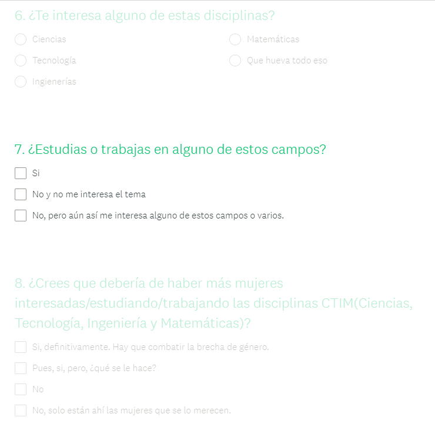

1. ¿Qué edad tienes?

2. ¿Qué tipo de redes sociales usas y cuál es tu favorita? (Respuestas múltiples)

3. ¿Con qué frecuencia usas alguna Red Social?

4. ¿Qué es lo que más amas de tu Red Social preferida?

5. Tienes redes sociales preferidas, pero hay partes del diseño que ODIAS, ¿cuáles son?

6. ¿Te interesa alguno de estas disciplinas?

7. ¿Estudias o trabajas en alguno de estos campos?

8. ¿Crees que debería de haber más mujeres interesadas/estudiando/trabajando las disciplinas CTIM (Ciencias, Tecnología, Ingeniería y Matemáticas)?

9. ¿Qué tan interesada estarías en una red social dedicada a estas disciplinas?

10. ¿Con qué frecuencia usarías una Red Social dedicada a mujeres del área STEM?

**Resultados:

La encuesta tuvo respuesta de 100 mujeres, cuyo promedio de edad es de 30 años, siendo las chicas entre 25 y 30 años las que más participaron.

De las entrevistadas el 95% tiene a Facebook como su red social favorita, seguida de Youtube con el 76% e Instagram con el 70%.

Las encuestas reflejaron que la mayoría de las mujeres son muy activas en sus redes sociales, pues el 95% de las encuestadas entran varias veces al día a sus redes sociales y solo el 5% interactúan poco.

Una de las preguntas más importantes que se les hizo a las usuarias fue relacionada a las cosas que más les gustan de sus redes sociales favoritas. Las respuestas fueron bastante variadas, pero poder compartir imágenes fue la que tuvo mayor peso con el 45% de respuestas recibidas; le siguió “poder estar en grupos de interés” con el 40% y “seguir páginas” con el 38%; las respuestas que menos fueron tomadas en cuenta por las encuestados fueron “encontrar cosas por # (hashtag) con 13%, “poder escoger otras reacciones aparte del me gusta” con el 13% y “explorar la sección de sugerencias” con un 8%.

Metiéndonos en la parte de los Paint points referente a las redes sociales preferidas de nuestras encuestadas nos dimos cuenta que el tener que descargar una app aparte para poder tener acceso a una funcionalidad en particular es algo que no le parece a la mayoría de nuestras encuestadas (66%); seguido de la existencia de tantos botones ya que el 49% de las encuestadas votaron por esto.

Por último la encuesta arrojó que aunque la mayoría (60%) no trabaja en CTIM; hay un interés genuino por estos tema, siendo que el 80% de las encuestadas contestó positivo al preguntarles sobre si les interesan los temas relacionados a las CTIM.
La segunda encuesta fue sobre la paleta de colores. En dicha encuesta se le pidió votar 4 paletas de colores:
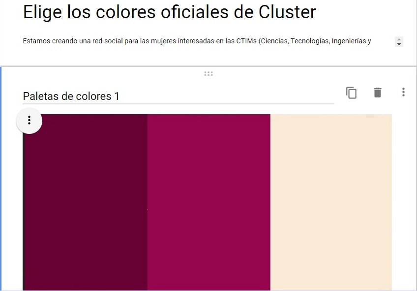
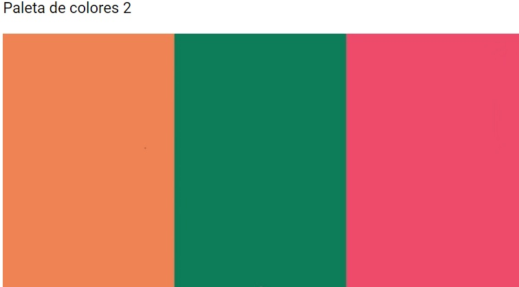
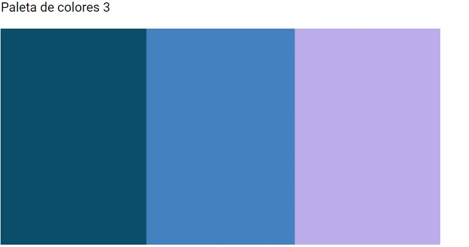
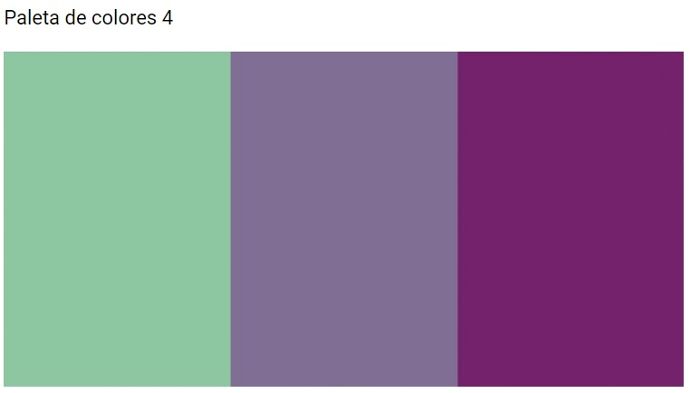
Aunque las personas encuestadas solo fueron 30, el 50% votó por la primera paleta de colores y dado que nuestro diseño está enfocado a priorizar a nuestras usuarias se optó por elegir esta paleta, además que el equipo cree firmemente en que estos colores gracias a su dinamismo representan perfectamente el espíritu de **Cluster**.

## Benchmark  :clipboard:

Para poder diseñar una red social que satisfaga a las usuarias al màximo

se analizaron productos similares y se compararon en base a sus procesos y funcionalidades.

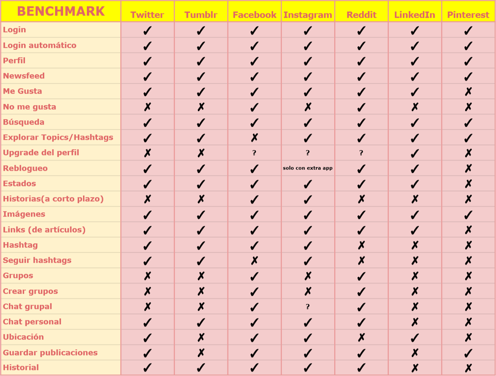

**Resultados:

## Mockups  :pencil2:

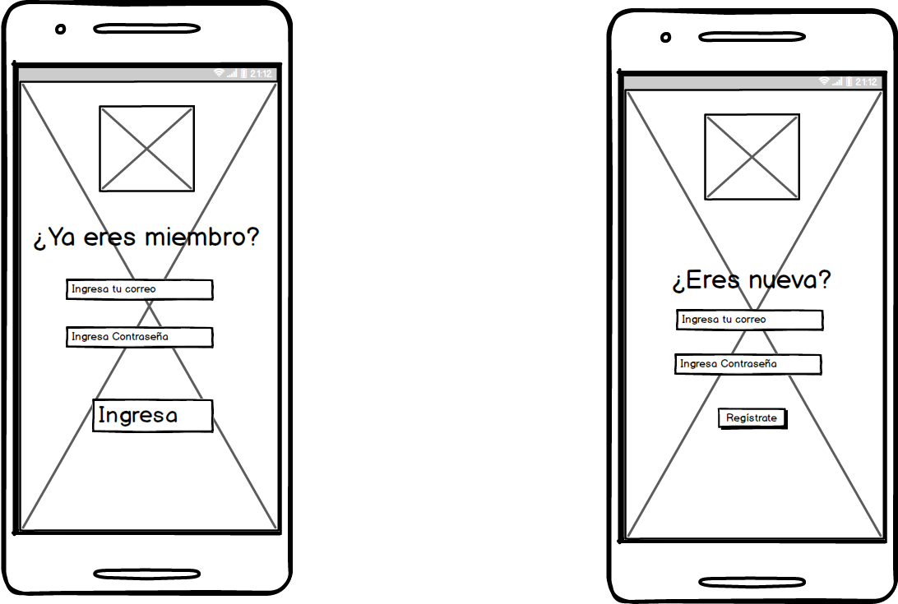

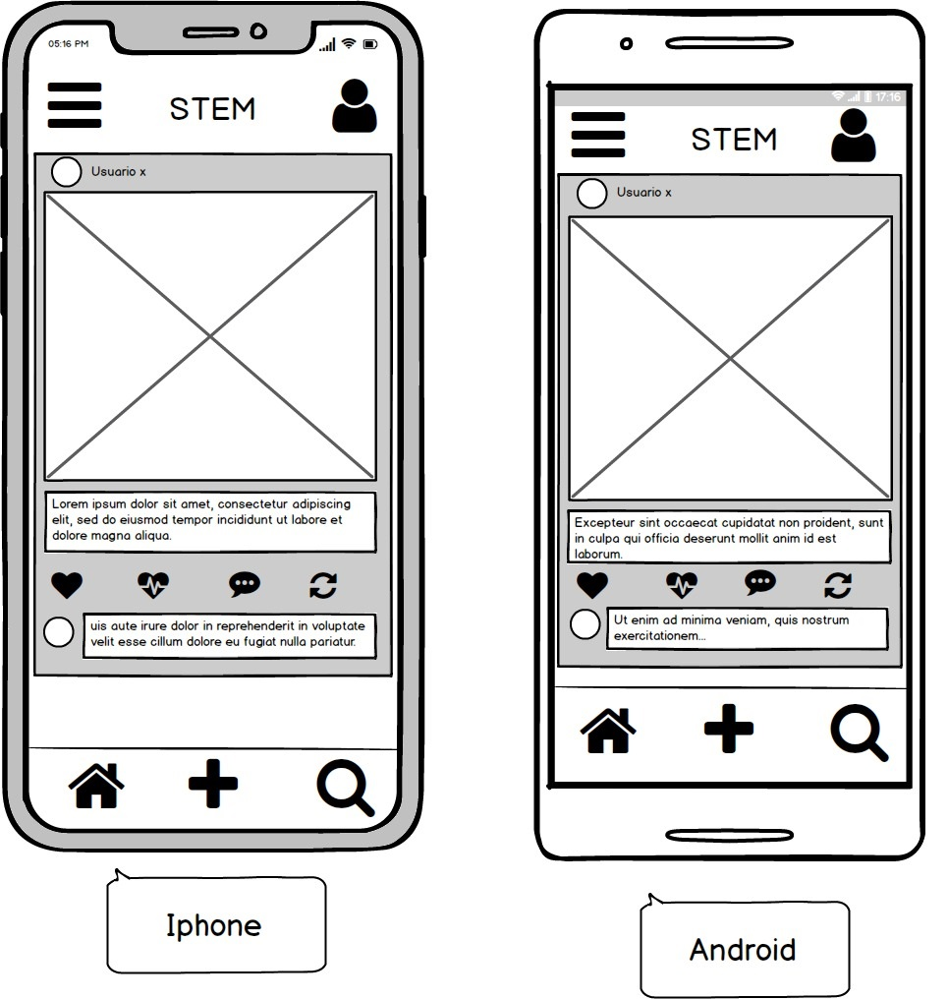

## Maquetado   :notebook_with_decorative_cover:

Para nuestro proceso de maquetado decidimos usar la plataforma digital "Canva". Esta maqueta es el reflejo de los datos obtenidos en las encuestas, por ejemplo, la paleta de colores y el hacer un diseño sencillo e intuitivo donde fueran pocos botones, pero con funcionalidad clara.


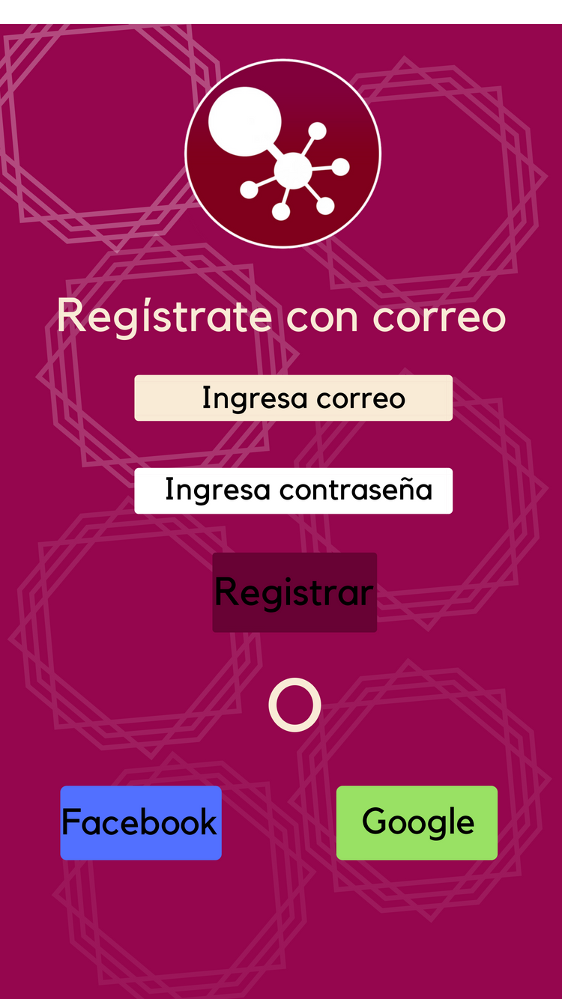

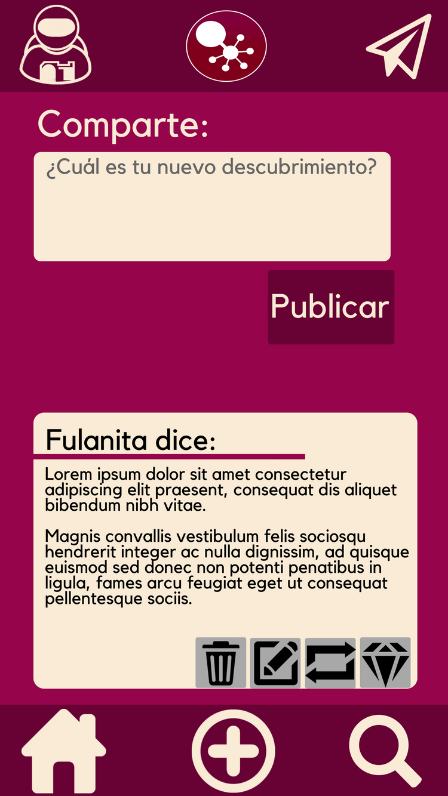

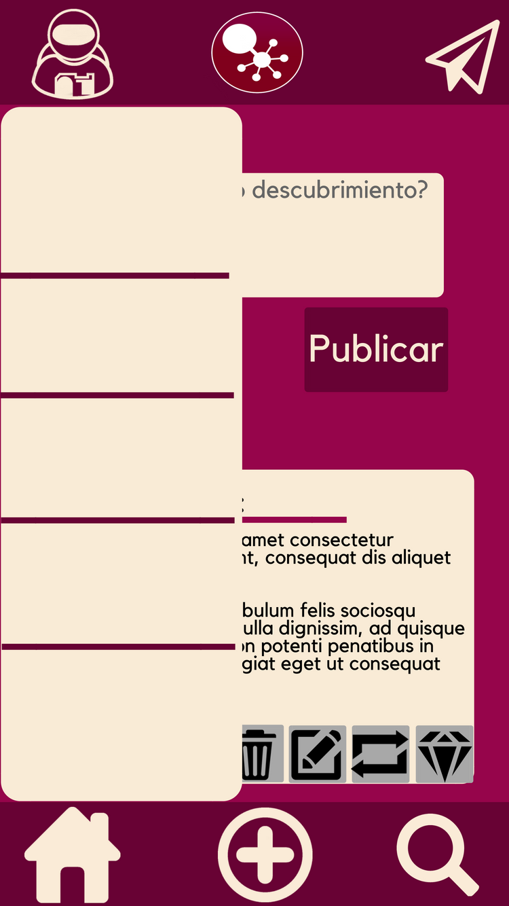

## Prototipo de alta fidelidad   :green_book:

Para poder interactuar con el flujo de usuario es necesario ingresar a la siguiente url:
(<https://marvelapp.com/72dcg23)>

## Boilerplate

```text
./
│
└── src
│   └── css
│   │   └── main.css
|   └── images
|   |   ├── benchmark.png
|   |   ├── encuesta1.png
|   |   ├── funcionalidad1.png
|   |   ├── funcionalidad2.png
|   |   ├── icon1.png
|   |   ├── mockup1.png
|   |   └── mockup2.jpeg
|   └──js
|   |   ├── app.js
|   |   └── index.js
│   └── views
│   |   └── view1.html
│   ├── app.html
│   └── index.html
│       ├── main.js
│       └── data.js
└── test
|   ├── data.spec.js
|   ├── headless.js
|   └── index.html
├── .editorconfig
├── .eslintrc
├── .gitignore
├── package.json
└── README.md

```

## Checklist  :clipboard:

### General

*[x] Producto final sigue los lineamientos del diseño.

### `README.md`

*[x] Definición del producto.

*[x] Benchamark de las principales redes sociales.

*[x] Resumen de entrevistas con usuarios.

*[x] Link/screenshots prototipo de alta fidelidad.

*[ ] Conclusiones de pruebas del prototipo con usuarios.

*[ ] Conclusiones de pruebas con el producto en HTML.

### Pruebas / tests

*[ ] Tests unitarios cubren un mínimo del 70% de statements, functions, lines,

y branches.

*[ ] Pasa tests (y linters) (`yarn test`).

### Creación de cuenta (sign up)

*[x] Permite crear cuenta.

*[x] Valida email.

*[x] Valida password.

*[x] Muestra mensajes de error.

### Inicio de sesión (sign in)

*[x] Permite iniciar sesión.

*[x] Valida email.

*[ ] Valida password.

*[x] Muestra mensajes de error.

### Muro (wall/feed)

*[x] Muestra __muro__.

*[x] Permite publicar nuevos posts.

*[x] Permite eliminar posts.

*[x] Pide confirmación antes de borrar posts.

*[x] Permite editar posts (in place).

*[ ] Permite filtrar posts por público/amigos.

*[ ] Permite marcar posts como __gustados__ (like).

## ¿Cómo usar Cluster?    :interrobang:

Para entrar a **Cluster** es necesario contar con un correo electrónico o una cuenta de Facebook o de Google.

Primero, la primera página te pedirá tus datos si es que ya eres una usuaria de **Cluster**, si no es así solo es cuestión de darle click al texto "Regístrate aquí", marcado en azul, esto te llevará a otra página donde podrás ingresar con alguna de las cuentas antes mencionadas.

Para entrar con una cuenta de Facebook solo es cuestión de clickear el botón con la leyenda "Facebook" y se mostrará un pop-up donde se debe de ingresar el nombre de usuaria de dicha red social y la contraseña, al darle click al botón de confirmar se desplegará la página principal de la red social.

Para ingresar con "Google" es el mismo proceso que con Facebook.

Para registrarse mediante el correo electrónico hay que poner el correo y la contraseña para **Cluster** (debe de ser mayor a 5 caracteres), posteriormente hay que darle click al botón de registrar, si los datos ingresados por la usuaria son correctos saldrá un alert avisando que debe entrar al correo electrónico antes dado a la plataforma pues le habrá llegado a la persona un correo de validación. Al darle click en el link este estará dado de alta exitosamente en **Cluster**.

Automáticamente la red social redirigirá a la usuaria a la página de "ingresar", donde la usuaria tendrá que poner su correo (dado de alta posteriormente) y la contraseña correspondiente, si todo fue ingresado correctamente la usuaria entrará a la sección principal de **Cluster**.

Dentro de la página principal la usuaria podrá hacer su primer comentario: Solo es cuestión de darle click al cuadro de texto donde dice " ¿Cuál es tu nuevo descubrimiento?", ahí se podrá poner el texto que se desee, seguido de eso solo es cuestión de darle "publicar" y así habrá quedado el primer comentario, el cual tendrá en la parte de arriba el nombre de quién lo posteó y la hora.
¡Felicidades! Ya sabes usar **Cluster**, la red social de las mujeres CTIM.

## Agradecimientos     :pray:

Queremos agradecer a Bluuweb! y a Falcon Master por sus videos en Youtube que nos ayudaron para ingresar a Firebase. También a todas nuestras compañeras, a nuestra coach Amalia, a nuestra Jedi Lucile y a todo el equipo de Laboratoria.
