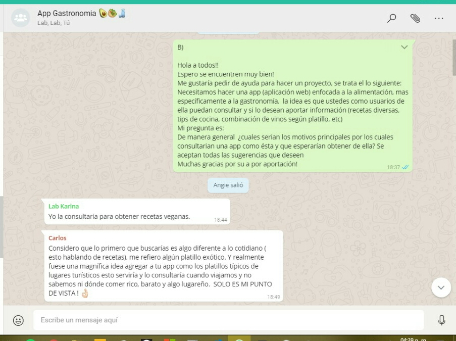
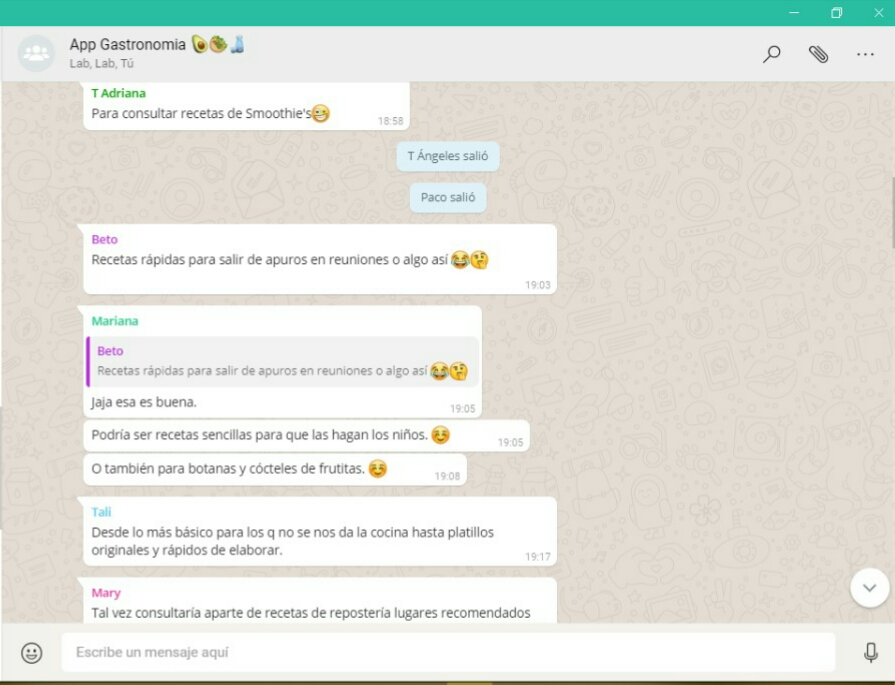
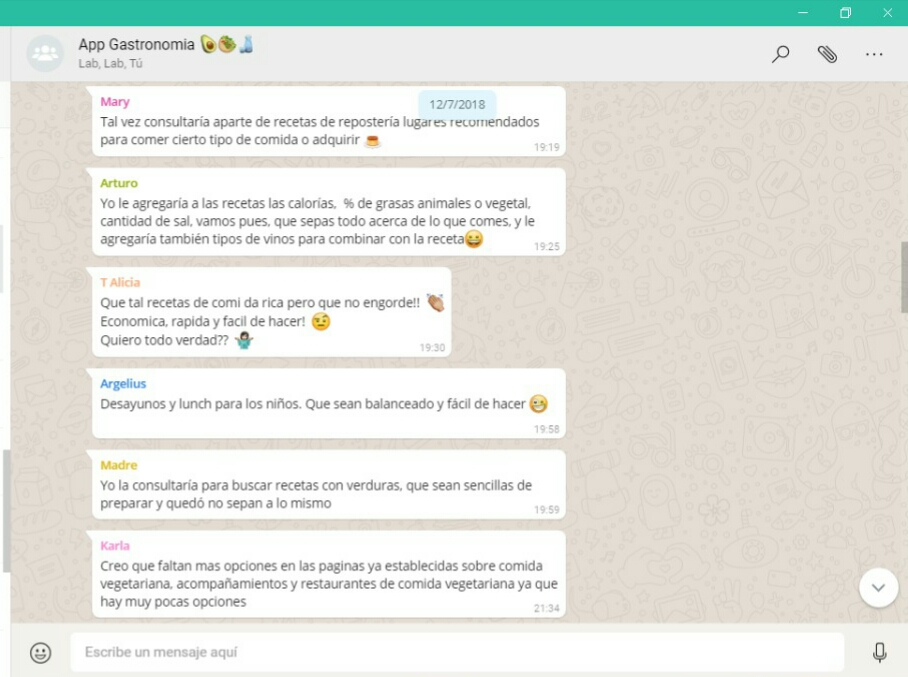
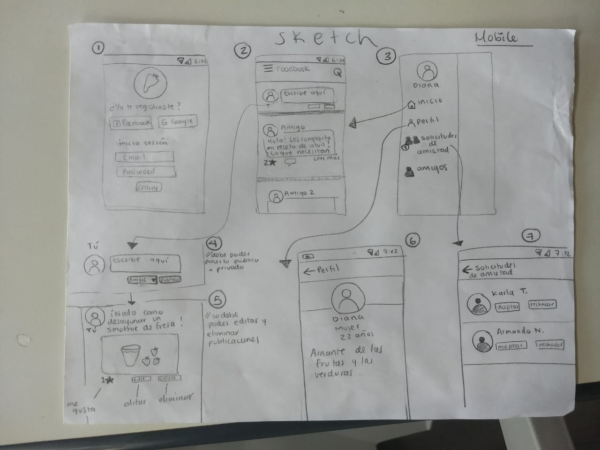
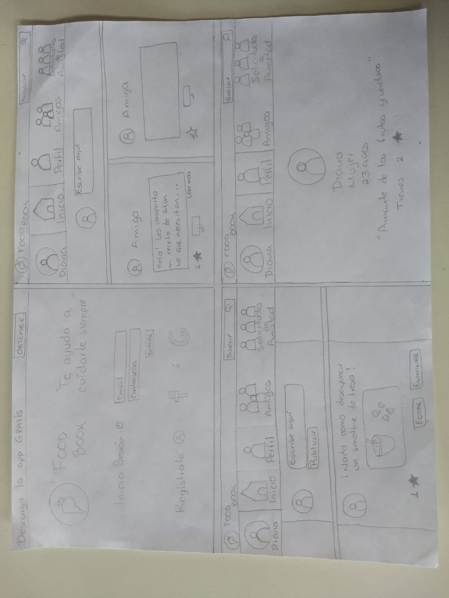
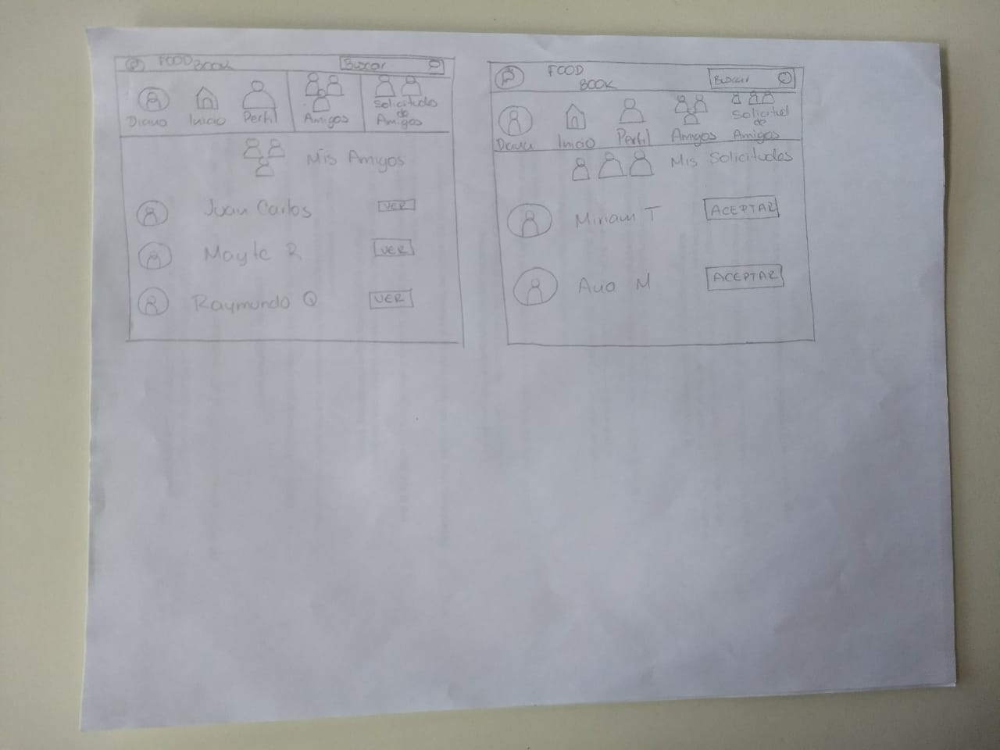
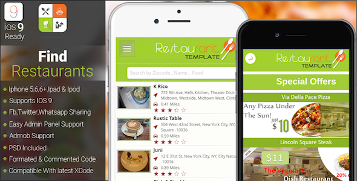
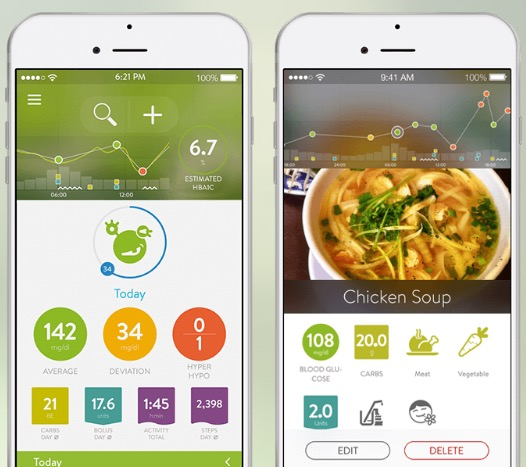
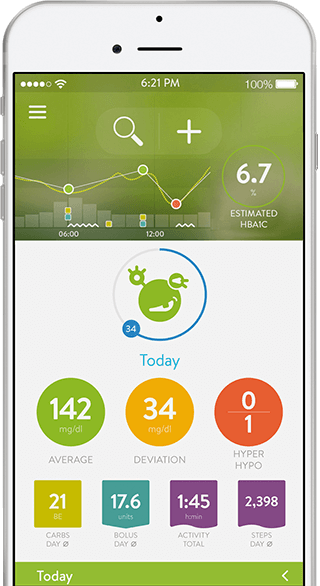
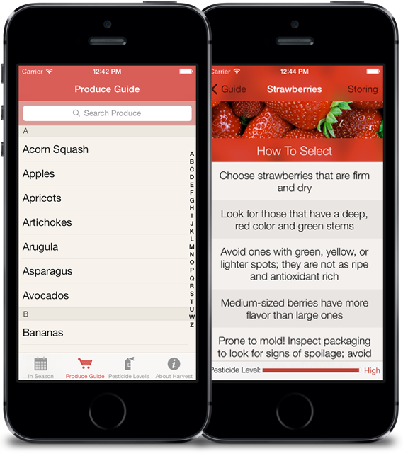

# Greener

**Introducción: ¿qué es una red social?**

Para poder entender lo que nuestro cliente solicita y con ello empatar nuestras ideas sobre el producto, debemos aterrizar el concepto y los elementos de una red social. Hoy en día todos utilizamos distintas redes sociales: Instagram, Facebook, twitter, entre las más conocidas. De éstas podemos observar que son servicios centrados en los intereses del usuario y sus relaciones personales. 

Una red social nos permite crear un perfil (público o privado)  para poder ser identificados por otros. Nos permiten compartir información de nuestro interés, publicar información en nuestro perfil, publicar en perfiles de nuestros conocidos; evaluar publicaciones y ser evaluados. Permiten  la posibilidad de interacción con otra persona, fomentan y fortalecen las relaciones entre usuarios creando comunidades con intereses similares o relaciones interpersonales en común.

En las ciudades como la CDMX es bastante común encontrar que las Redes Sociales se han convertido en algo constante, cotidiano e indispensable para la mayoría de las  personas. Gracias a éstas nos es posible encontrar un espacio creativo de convivencia virtual que nos une a nuestros seres queridos y a las personas con nuestros mismos intereses. 

**Problemática**

Es bien sabido que en México es uno de los países con más problemas de obesidad. Según un artículo de la *BBC*, La Organización para la Cooperación y el Desarrollo Económicos (OCDE) realizó un estudio en 2015, se encontró que Estados Unidos es el país que encabeza la lista, con el 38,2% de la población mayor de 15 años con obesidad mientras México ocupa el segundo lugar con el 32,4% de la población y Nueva Zelanda con el 30,7%. Se estima que a largo plazo los niveles de obesidad aumentarán para el 2030, como también ocurre en otros países como Estados Unidos, Inglaterra, Canadá, Francia y España.

Para tener una mejor idea de la problemática realizamos un sondeo para delimitarla y entender posibles soluciones que el usuario emplearía.

 

Derivado de esto consideramos conveniente realizar una serie de preguntas en torno a estos resultados, los cuales arrojaron lo siguiente en este
[Cuestionario](https://docs.google.com/forms/d/1y8orWsIOjkrOVd1Yfd35Uo6qiF26XfBipm9aP9Tksmw/edit#responses)

Lo más destacado de ésta encuesta, se mencionan en los siguientes puntos:

* Nuestros encuestados están en un rango de edad de entre los  24 a los 35 años.
* Trabajan y/o  estudian tiempo completo.
* Consideran que tienen problemas para alimentarse sanamente
* No encuentran opciones saludables, cuentan con poco tiempo para la elaboración de sus alimentos, cuentan con poco presupuesto, no quieren invertir tanto tiempo en la preparación y no les son apetecibles las opciones sanas.
* Están conscientes de la importancia de los buenos hábitos de la alimentación y su solución, sin embargo viendo los resultados de los puntos anteriores carecen de una buena organización.

 A pesar de que la mayoría lleva su comida al trabajo o escuela, consideran que no son las mejores opciones y esto es porque no conocen más variantes a la hora de la preparación. 

Por ello pensamos en crear una red social que brinde un espacio para personas que busquen un cambio significativo en su alimentación de la manera más creativa, atractiva y sencilla.

Nos dimos a la tarea de  entender las motivaciones y  propósitos de nuestros usuarios para brindar en conjunto con ellos herramientas que puedan ayudarlos a sustentar buenas prácticas alimenticias haciéndolos partícipes en este proceso. Con esto pretendemos dar apoyo a los usuarios que buscan mejorar su calidad de vida pensando en el contexto en el que se desenvuelven día a día.

**¿Quiénes son los principales usuarios?**

Nuestros principales usuarios son mujeres y hombres de entre  los 25 y 30 años que trabajan y/o estudian. Están fuera de casa todo el día, esto implica para ellos no tener tiempo para preparar sus alimentos.
Los resultados nos hicieron ver la problemática real, la cual nos dice que muchos de estos encuestados son personas que dependen de alguien más para su alimentación. Notamos que no hay coherencia en sus respuestas al decir que no tienen tiempo para preparar alimentos, sin embargo  llevan comida, preparada en su casa, a su oficina o escuela.La pregunta aquí es: *¿quién les prepara esa comida?* 
Intuimos que como sociedad mexicana, las madres o parejas son quienes se encargan de prepararles estos alimentos y por ello pensamos en nuestro target final: *"las personas que quieren hacerse cargo de su alimentación y ya no desean depender de alguien más para la elaboración de estos alimentos".*

Las largas jornadas de trabajo sentados frente a un computador o en un salón de clases forman parte de su cotidianeidad,  así como caminos que se complican aún más por el tráfico y que deben recorrer por la ciudad al salir de casa para ir a la oficina y viceversa; distintas actividades que van excluyendo el cuidado personal y particularmente, la alimentación y la falta de actividad física, esto conlleva a un desgaste dejándolos sin motivación para realizar actividades extras.

**¿Cuáles son los objetivos de estos usuarios en relación con el producto?**
 
Tener una fuente de consulta, aportar a esa fuente y ser un participante activo dentro de la misma, encontrar motivación en una comunidad que tiene el mismo fin de independizarse en cuanto a su hábitos alimenticios y conocer gente dentro de esa misma comunidad.

Así mismo planteamos los objetivos de los usuarios con respecto al producto utilizando las historais de usuario.

* Yo usuari@ quiero poder registrarme en 'Greener'
* Yo usuario quiero poder iniciar sesión con facebook o google para ser parte de 'Greener'
* Yo como usuari@ logueado quiero poder hacer publicaciones para comunicarme con personas como yo que busquen una mejora en su alimentación sin tener mucho tiempo para preparar alimentos. 
* Yo como usuari@ quiero poder contribuir y recibir  tips o recetas, videos y fotos, para ayudarnos a mejorar nuestra alimentación, lo cual nos brindará motivación y una mejor calidad de vida
* Yo como usuari@ quiero poder dar  y recibir like a las publicaciones de mis amigos.
* Yo como usuari@ quiero poder ver cuántos  likes/Estrella (o similar) tiene una publicación.
* Yo usuari@ quiero poder eliminar un post/publicación específico.
* Yo usuari@ quiero darle click en el botón editar, cambiar el texto, imagen, post e imagen, o lo que contenga la publicación. 
* Yo usuari@ quiero que al recargar la página pueda ver los textos editados y publicaciones anteriores (persistencia).
* Yo usiari@ quiero poder cerrar sesión.

Como un segundo alcance se plantearon las siguientes hisotrias:

* Yo usuari@ quiero poder agregar nuevos amigos
* Yo usuari@ quiero poder aceptar solicitudes de amigos
* Yo usuari@ quiero poder eliminar amigos
* Yo usuari@ quiero poder poder filtrar los posts sólo para mis amigos y para todo público.
* Yo usuari@ quiero poder publicar solo para mis amigos
* Yo usuari@ quiero poder poder publicar públicamente, visible para todos los usuarios de la red social.
* Yo usuari@ quiero poder enviar mensajes privados a mis amigos.

# Ideación

**Prototipado**

A continuación mostraremos el primer sketch, pensando primero en el dispositivo móvil, pues es más cómodo para el usuario accesar a través de éste a una app.

 

Version Desktop

Así mismo elaboramos un [prototipo de alta fidelidad](https://www.figma.com/proto/cI2y8tMN0p8NghxQI8fsfBME/foodbook?node-id=4%3A2&scaling=scale-down). Cabe aclarar que en el proceso de construcción de la web app, fuimos transformando el diseño de acuerdo a los feedbacks recibidos. 

### Fundamento para el protrotipado

La idea principal de nuestra red social no es sólo ofrecer, como muchas, recetas saludable, si bien se basará en esto, lo principal es crear y fomentar la autonomía de la alimentación de todo aquel que ya haya tomado este primer paso. Nuestra comunidad ayudrá con ese gran paso ofreciendo consejos e ideas de usuaros que estuvieron es esa misma situación y cómo salieron de ello.

Teniendo en cuanta que la comida entra por lo ojos, sabemos que la toma de decisiones en cuanto a colores e imagenes es primordial para motivar al usuario, el uso de lenguaje poco técnico en las recetas y tips, es de las mayores preocupaciones entre los usuarios al igual que los utensilios de cocina. El color es capaz de estimular o deprimir, puede crear alegría o tristeza. Así mismo, determinados colores despiertan actitudes activas o por el contrario pasivas. Con colores se favorecen sensaciones térmicas de frío o de calor, y también podemos tener impresiones de orden o desorden.

Para nuestra red social hemos decidido incorporar el color verde en nuestro logotipo haciendo referencia a una vida saludable y más verde, como  el mismo nombre de la app (greener) lo dice. Así mismo investigamos que dicho color es asociado con:

* salud y tranquilidad
* Simboliza el dinero
* Denota naturaleza
* Alivia la depresión
* Es utilizado en gafas de visión nocturna porque el ojo humano es más sensible y capaz de discernir los contrastes y las sombras
* Representa un nuevo crecimiento

En marketing:

* Usado para relajar en las tiendas
* Asociado con riqueza
* Ha sido un símbolo de fertilidad

También hemos  incorporado el color blanco como fondo; éste es asociado mayormente a tópicos relacionados con la pureza, inocencia, optimismo, frescura, limpieza y simplicidad. En el campo de Marketing el color se asocia con una marca amigable, alegre y confiable. Utilizamos fuentes de texto "ligeras" tanto en el logotipo como en los textos de la aplicación con el objetivo de armonizar la interfaz con nuestro concepto.

#Benchmark

 Realizamos un bechmark específicamente con las redes sociales que giran entorno a temas alimenticios : [benchmark](https://docs.google.com/spreadsheets/d/14YIrKK5kG2i1GkdOf4_KPQNa5-7Ytr2HgYstnk-Ihzs/edit#gid=1389167076)
 Así mismo encontramos las 15 apps (no necesariamente redes sociales) más utilizadas para promover una buena alimentación. Toda se pueden descargar y probar en smartphone o tableta. Todas ellas ayudan a conocer más a fondo el mundo de la comida y a descubrir qué alimentos son más saludables, cuál es su origen, cómo cocinarlos o incluso conocer qué ejercicio físico es necesario para “quemar” esa golosina que te acabas de comer.

### 1 Harvest 
¿Cuáles son los mejores productos para una determinada época del año? ¿Cómo almacenar la comida? Harvest permite responder a estas preguntas, ofreciendo trucos y respuestas a 120 frutas y verduras, con el objetivo de que los usuarios las conozcan con profundidad. Disponible sólo en plataformas iOS.

### 2 MySugr
Ideada para ususarios con diabetes, MySugr Logbook es una app que permitirá llevar un registro del azúcar que consumimos con nuestros alimentos. En educación podemos usarla de un modo universal, para que nuestros alumnos investiguen las cantidades de azúcar que implican ciertas comidas, o para descubrir cómo mejorar su alimentación en cuanto a esta variable. La encontramos en iOS y en Android.

### 3 True Food Shoppers Guide
Aunque destinada a un público adulto que quiera tener una buena alimentación en su día a día, True Food Shoppers Guide puede ser un complemento genial en algunas actividades de Secundaria y Bachillerato: permite conocer los ingredientes con los que se realizan ciertos alimentos, y si éstos han sido modificados genéricamente. Es gratuita y está disponible en iOS y en Android.

### 4 MyFitnessPal
Una de las apps más conocidas para conocer las calorías de los alimentos es también un excelente complemento para fomentar una buena alimentación. My Fitness Pal cuenta con una enorme base de datos que nos dará la composición de prácticamente cualquier alimento, incluyendo las kilocalorías que aporta y muchos otros datos. Esto incluye desde ingredientes sueltos hasta marcas y alimentos ya preparados, y es una plataforma excelente tanto en su versión web como en sus apps disponibles para iOS y para Android.

### 5 ShopWell
¿Cómo conocer los alimentos que ingerimos? ¿Son saludables? ShopWell es una app que te permite conocer al instante información relativa a todo tipo de productos, con sólo escanear su código de barras. Esto permitirá que, por ejemplo, los usuarios pueden comprar alimentos y conocerlos con más profundidad a través de esta app. Está disponible en iOS y en Android.

### 6 Diana come Sano
La Fundación Mútua General de Catalunya ha publicado en las tiendas de aplicaciones móviles Diana come Sano, una app completamente gratuita en la que jugaremos con Diana, una joven pelirroja que nos irá guiando a través de diferentes juegos y puzzles con los que aprenderemos los principios básicos de una buena alimentación. Es completamente gratuita y está disponible en plataformas iOS y en Android.

### 7 Healthy Food Monsters
Un pequeño monstruito será el personaje que manejaremos en Healthy Food Monsters, y nuestro objetivo es el de ingerir los diferentes alimentos que aparecen en el mapa: deberemos escoger los poco saludables, y eliminar —con unas pequeñas bombas— a los que pueden ser nocivos, como hamburguesas o pizzas. Fácil y sencillo, orientado a niños alrededor de los 6 años para pasar un buen rato; está disponible en iOS y es gratuita.

### 8 Veggie Circus Farm
Para un público aún más joven, de alrededor de los 2 años, se lanza Veggie Circus Farm: para aprender a pronunciar cómo se dicen 15 vegetales habituales en el mundo, y adentrar así a los pequeños en el mundo de la comida sana con la verdura. Para que les pierdan el miedo a las zanahorias, brócolis y que cuanto los vean en el plato no los rechacen inmediatamente. Disponible una versión ‘lite’ gratuita en iOS y en Android a través de la Amazon App Store.

### 9 Learn Fruits and Vegetables for Kids
También para un primer contacto, Learn Fruits and Vegetables for Kids es una sencilla app con la que los niños podrán interactuar para conocer la pronunciación y la escritura de algunas frutas y verduras esenciales. Incluyen, además, algunos puzzles para divertirse y tests con los que poner a prueba los conocimientos de niños de hasta 5 años. Disponible en Android gratis.

### 10 Eat Smart
Aunque hay una comunidad de comida sana con este nombre, la realidad de Eat Smart es que es una aplicación independiente orientada a jóvenes a partir de los 4 años. Se trata de un juego de plataformas en el que deberemos ir saltando para avanzar en cada nivel, procurando evitar la comida nociva y prefiriendo la sana. Sencilla y divertida para jugar un rato, disponible completamente gratis en iOS y en Android.

### 11 Food Truth
La “verdad sobre la comida” es una página web pero también una app disponible gratis en iOS, que nos cuenta todo sobre los ingredientes. Algunos serán comunes, pero otros de esas rarezas que muchos no se atreven a probar por mero desconocimiento. Food Truth nos permite conocer a fondo los alimentos y, de paso, nos da unas cuantas recetas saludables y de temporada para que conozcamos cómo utilizarlos en la cocina.

### 12 Awesome Eats
Imagina un huerto virtual en el que tienes que recoger y ordenar frutas, vegetales y grano para ir avanzando. Awesome Eats busca que los más jóvenes se acerquen a los alimentos más sanos de la alimentación en base a mostrarlos con sencillos juegos que han sido pensados para niños a partir de los 6 años. Varias decenas de niveles están disponibles en iOS y Android, en todas ellas de forma gratuita.

### 13 Fooducate
Fooducate pone en una app móvil (disponible en smartphones y tabletas Android) todo lo necesario para llevar a cabo una dieta sana y equilibrada. En un ámbito educativo es interesante, por ejemplo, para comprobar si las comidas que los jovenes van realizando son saludables o no, y cómo pueden mejorarse, gracias al registro de salud que incluye y que permite escanear los códigos de barras de los alimentos.

### 14 Nicolas’ Garden
Esta app es un caso muy particular, ya que su idea ha sido desarrollada por Nicolas Come, un ’emprendedor’ de sólo 9 años. El objetivo de Nicolas’ Garden, disponible en iOS y en Android completamente gratis, nos permite disfrutar de cientos de recetas saludables y que los propios niños pueden realizar. Combina explicaciones tanto de los ingredientes como de la secuencia necesaria para realizar cada una de las recetas, todas ellas pensadas en que niños de entre 5 y 15 años puedan ponerlas en práctica.

### 15 Eat & Move-O-Matic
Y terminamos con Eat & Move-O-Matic, la más “gamificada” de todas las que hablamos aquí. Diseñada y desarrollada por la New Mexico State University, dispone de una serie de pequeños juegos, preguntas y respuestas y comparativas que nos permitirán ahondar tanto en la parte de la nutrición de los alimentos como en la del ejercicio físico, con mucha información que muestra de forma tremendamente visual. Disponible gratis en iOS.
   
En su mayoria, las aplicaciones usan colores y lenguaje muy sencillo de entender, su interfaz es muy organica y contrastante, usan de fondo el blanco para que los colores, verde, naranja o rojo, que son los que más se usan, no sean tan agresivos.

# Instructivo

Para utilizar Greener puedes acceder desde tu cuenta de Google o Facebook clickando en los botones correspondientes o bien puedes registrarte con otra cuenta de correo e iniciar sesión. Comparte publicaciones con tus amigos escribiendo en el input y dando click en publicar. Así mismo:
 * Si estás logueado con una cuenta que registraste en tu nombre aparecerá tu mail.
 * Es necesario escribir "algo" para poder publicar.
 * Puedes eliminar tus posts o los de tus amigos dando click en BORRAR.
 * Puedes editar tus posts o los de tus amigos dando click en el botón "EDITAR"; después edita tu texto y da click en el botón GUARDAR para actualizar tu post. 
 * Para ver el conteo de favoritos en la publicación y agregar un favorito, da click en el corazón.
 * Si deseas salir de la aplicación da click en "LOG OUT". 
 * Disfruta y ayuda a tus amigos a cambiar su alimentación por una vida más saludable. Agrega a "Greener" contenido que tus amigos y tú comparten sobre alimentación saludable con recetas sencillas.  