# **RED SOCIAL** 

## **Proceso de UX**

### **Descubrimiento e investigación:**

#### **Introducción:**

De acuerdo con el portal de Definición ABC una Red Social es una estructura social integrada por personas, organizaciones o entidades que se encuentran conectadas entre sí por una o varios tipos de relaciones como ser: relaciones de amistad, parentesco, económicas, relaciones sexuales,intereses comunes, experimentación de las mismas creencias, entre otras posibilidades.

Desde la década pasada las redes sociales rigen el mundo y han cambiado la forma en la que nos comunicamos. Según la última encuesta de Smart Insights sobre Mobile Marketing, en 2015 el 79% de los usuarios de teléfonos inteligentes aseguró utilizar aplicaciones móviles casi todos los días y pasar cerca del 86% de su tiempo navegando en la web, ¡imagina cómo será para los 

#### **Análisis argumentativo:**

Con el pasar del tiempo, la tecnología se ha convertido en un excelente aliado para las mujeres, que quieren conocer más sobre el mundo de la maternidad; En el portal web, “ticweb” definen a las madres internautas como un “grupo de mujeres, con al menos un hijo, que participan activamente en las redes sociales” para cualquier tipo de consulta; pero especialmente en temas que tienen que ver con su influencia en la crianza de sus hijos, bien sea consejos, tendencias o avances en esta materia.
Cada día es más común que las mamás latinoamericanas usen la tecnología y los medios digitales para organizar su rutina, buscar y compartir información relevante en diferentes ámbitos de la vida. En él país hay 65 millones de internautas y el 50% son mujeres, según el 12 Estudio sobre los Hábitos de los Usuarios de Internet en México 2017 elaborado por la asociación mexicana de Internet (AMIPCI), el segmento de millennials se compone principalmente por mujeres de 26 años de edad, quienes poseen en promedio 4 dispositivos: smartphones, laptops, tabletas y smart tv´s.
Sobre el segmento de mamás millennials en México no hay reportes o estudios. Sin embargo, el Interactivo Advertising Bureau (IAB), organismo a nivel global que representa a la industria de la publicidad digital y marketing interactivo, presentó en 2016 el State of Modern Motherhood Report obile and media in the lives of moms, en el que señala que 8 de cada 10 nacimientos son de la generación de madres millennials. La edad promedio del primer embarazo de esta generación es de 25 años. El 65% de las mamas tienen hijos menores de 6 años y el 61% son madres solteras. El 53% de estas mujeres poseen un teléfono inteligente y una tableta.

El estudio reporta que este grupo de madres internautas busca sitios electrónicos donde se de asesoramiento de expertos dirigidos para padres; experiencias y consejos sobre la crianza en redes sociales; blogs hechos por mamás; y apps para padres y bebes.

En lo que respecta a las compras en línea, se informa que este sector es muy participativo en comparación con generaciones anteriores. Una de cada cuatro mamas de la generación adquiere productos por internet relacionados con ropa, electrónica, servicios financieros y cuidado personal, entre otros. 

#### **Entrevistas:**

Se realizaron 25 entrevistas con 15 preguntas con  el fin de recabar información, que nos guiara en la identificación  de las necesidades  y las inquietudes de estas madres, obteniendo los siguientes resultados:

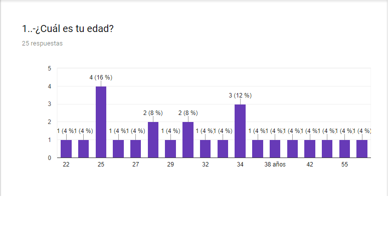
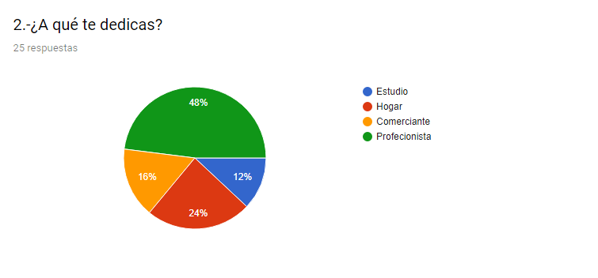
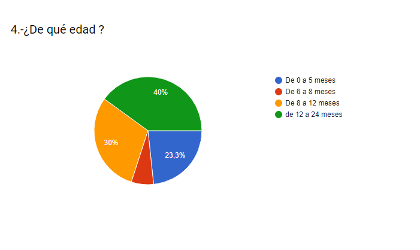
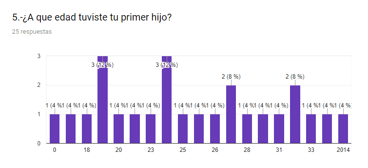
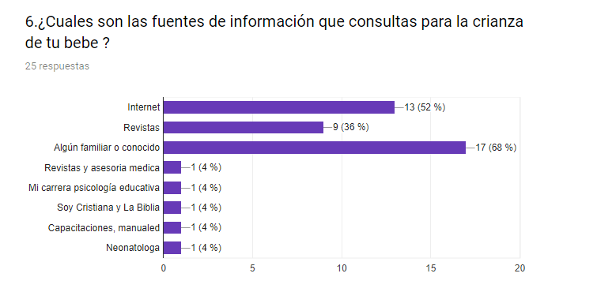
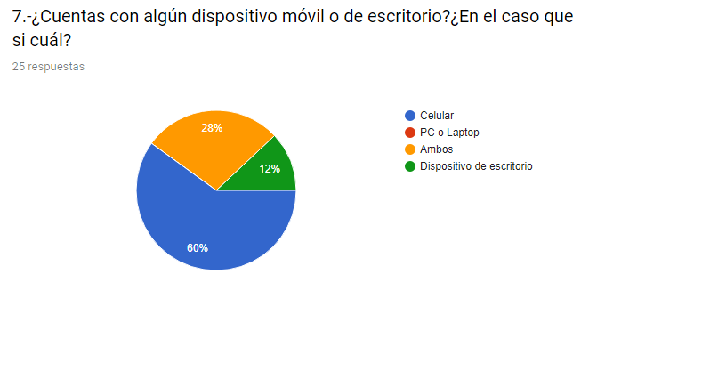
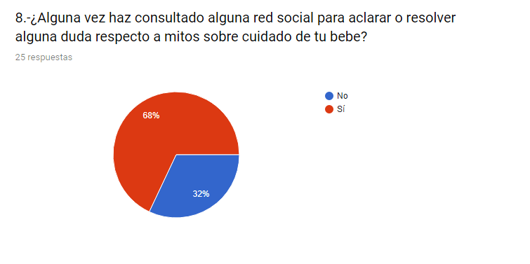
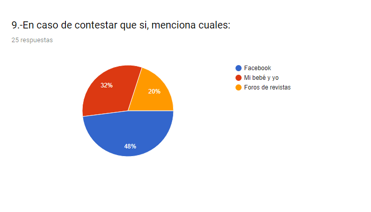
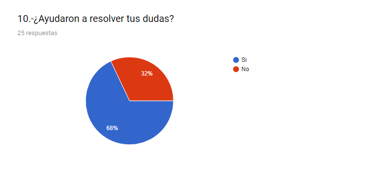
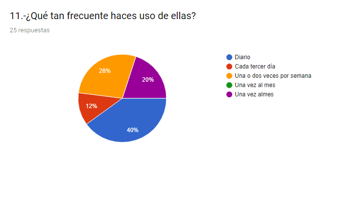
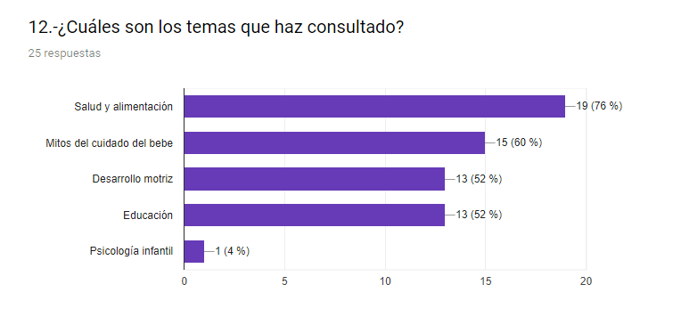
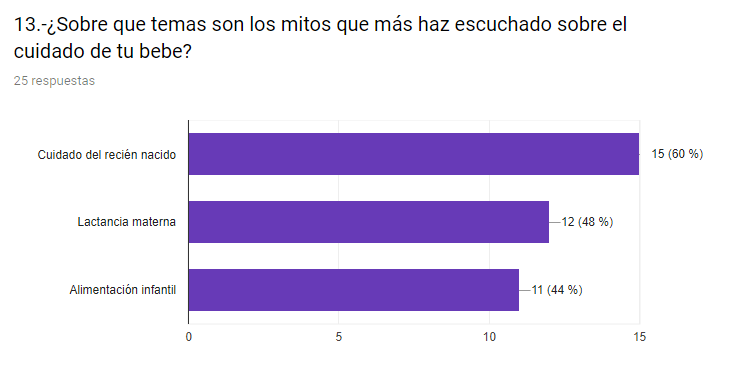
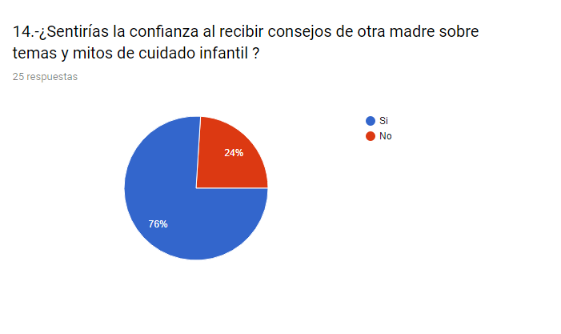
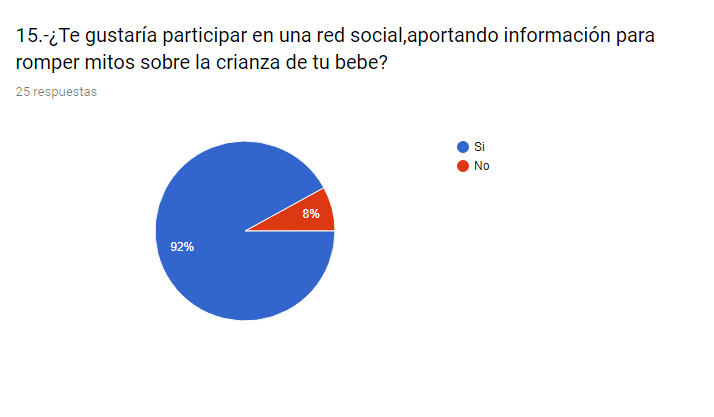

La edad promedio de las entrevistadas fue de 25 a 34 años, la mayoría profesionistas (48%), con un promedio de 1 a2 hijos, con edades de 0 a 24 meses. La edad promedio de su primer alumbramiento fue de los 19 a los 24 años. La mayoría de sus fuentes de información sobre temas relacionados sobre la crianza de su bebe fue promedio de su familia (71.4%), quedando en segundo lugar internet (53%) y revistas sobre el tema en tercero (35.7%).De las redes sociales que más consultaron destaca FB(48%), Mi bebe y yo (32%) entre otros foros de revistas, la información la consultaron la mayoría desde su dispositivo móvil (60%), el 40% consulta diario estas redes. Los temas más consultados fueron salud y alimentación, mitos y cuidados y salud infantil, sobre los temas de mitos que más les llamaron la atención  están: cuidados del recién nacido, lactancia materna y alimentación infantil. El 67% de las mamás resolvieron sus dudas. Al preguntar si estarían dispuestas a participar en una red social aportando y consultando estos temas sobre romper mitos el  76% consultaría, ya que se sentirían en confianza de compartir estas dudas con otras mamás con mayor experiencia y de igual forma  el 92% participarían compartiendo experiencias para ayudar para resolver dudas.

### **Usuarixs y necesidades:**

México es un país multicultural por su diversidad étnica, por ende, es rico en creencias y tradiciones (muchas veces erróneas que podrían llegar incluso a perjudicar la salud). Son muchas las creencias y los mitos que rodean el cuidado del menor cuando está recién nacido y a lo largo de sus primeros años de vida y es frecuente que algunas madres primerizas se enfrenten a una serie de temores y dudas al ingresar a un mundo totalmente nuevo, independientemente de su estatus social  o nivel de educación. Al surgir todas estas dudas  recurren a personas con mayor experiencia en el tema y acogen estas creencias y mitos  ya sea por presión social o tradición.

### **Justificación y delimitación del tema:**

Al inicio  nos habíamos centrado en el tema de alimentación infantil, pero al realizar la investigación y tener el acercamiento con estas madres primerizas, identificamos la necesidad de contar con una plataforma, de fácil acceso con información de especialistas refutando los mitos más populares, así como un foro donde pudieran consultar sus dudas, debatir y aportar información con otras madres que estaban o pasaron por lo mismo.
Actualmente no se cuenta con una red social con esta temática, ya que la mayoría de las que actualmente existen solo se centran en la información normalmente manejada (alimentación, educación y salud), y algunas pocas solo cuentan con solo alguna publicación sobre 10 mitos populares (Los  cuales son pocos y repetitivos).
Los beneficios obtenidos al hacer uso de esta red social, es que como usuaria puedes acceder a la información puntual que se está buscando desde cualquier dispositivo, justo en el momento que surge la duda y que esta sea aclararla de manera rápida por otras madres que ya pasaron por lo mismo y tienen mayor experiencia. 

#### **Incentivos:**

Se ha pensado en  reclutar a las usuarias y mantener un portafolio de  “Súper mamás” las cuáles serán las usuarias con mayor actividad en la página, ya sea por consulta de algún tema o por resolver dudas de otra usuaria. A estas “Súper mamás”  se les gratificara por medio de incentivos que se medirán por medio de likes. Mensualmente se llevara a cabo un sorteo donde se premiara a la mami más activa y con mayor número de registro de likes en  sus publicaciones.   

### **Historia de usuarix:**

1-Paty  es profesionista, es madre de un pequeño de 5 meses, fue criada en una familia tradicionalista y esta abrumada por todos los consejos (mitos) que recibe tanto de sus abuelas, madre y suegra día a día para ser una “Buena madre”. Ella ha buscado en redes sociales, foros de discusión y revistas información sobre los mismos, pero no ha encontrado un lugar donde pueda consultar sus dudas puntuales, tampoco se siente con la confianza de consultarlas con su pediatra, ya que siente que este la juzgara. Esta página será de gran ayuda ya que al surgir cualquier duda en cualquier momento, Paty podrá consultar con otras mamis con experiencia en el tema, con la confianza de que sus dudas serán resueltas y nadie la catalogara por tener este tipo de dudas.

2.-Luz es madre de un pequeño de 3 meses, el cual sufre de cólicos constantemente. Al no tener a alguien con experiencia y no contar con dinero para  consultarlo con algún profesional de la salud, decidió  buscar en internet y encontró información sobre un “te” para aliviarlos. El pequeño enfermo de infección renal, ya que es toxico este alimento para su edad. Luz pudo evitar esta complicación al consultar oportunamente en esta plataforma y recibir los consejos de mamis con mayor conocimiento sobre este tema. 

3.-Clara tiene un pequeño de 9 meses, su madre le recomendó que desde pequeño le diera todo tipo de alimentos “para que se acostumbre  ellos”. El pequeño ahora sufre de una alergia alimentaria ya que su sistema digestivo aún no estaba lo suficientemente desarrollado para digerir estos alimentos. Al pertenecer en este comunidad Clara podría recibir información constantemente sobre los alimentos correctos (ingredientes, texturas, etc) que debería de integrar a la dieta de acuerdo a su edad.  

### **Benchmark :** 

Se realizó el comparativo de 6 redes sociales más populares (Todo bebé, Baby center, Work it Moms, Mi bebé y yo, bbMundo y ABCdelbebé ) según el portal Frontera.info, que hablan sobre cuidado y crianza del  bebé que consultan las mamás latinas.
Se consideraron diferentes puntos importantes que deben contener estas redes sociales, para que su funcionalidad y contenido sea de interés para estas usuarias. Un punto significativo es que el idioma sea español, ya que esta res social está enfocada en madres latinas, la aplicación tiene que ser responsive ya que de acuerdo a las encuestas realizadas este es el dispositivo en el que la mayoría consulta la información, es importante que tenga la opción de crear un perfil o usuario, ya que  aumenta la privacidad al no permitir que nadie acceda a información de  tu cuenta (consultas, comentarios, etc.). El tener una asesoría de expertos de diferentes temas es un plus de la página ya que las usuarias las consultan regularmente con la confianza de aclarar sus dudas con alguien conocedor del  tema. Existen diferentes temas base que son los que con regularidad consultan estas usuarias (alimentación, salud, cuidado y crianza). También es importante  que en estas comunidades exista la opción de comentar los temas publicados ya que de esta forma se pueden obtener puntos de vista diferentes y enriquecer los mismos. El tema de mitos sobre la crianza es un tema crucial ya que al ser México un país de tradiciones que adoptan estos mitos, haciendo que muchas veces las usuarias tengan duda de que tan ciertos son o en que puede afectar el aplicarlos.

https://docs.google.com/spreadsheets/d/11UVx3-tUbdZD5ck7sHXp0QIM9sb49Q35gR7SkUsZdhw/edit#gid=0

Despues de la comparación de las 6 redes sociales más populares entre las mamás latinas, se encontraron areas de oportunidad en dos puntos,en tener la opcion de opinar sobre los temas publicados(ninguna cuenta con esa opcion) e informacion sobre mitos de la crianza y cuidados (solo algunas cuentan con una publicacion de algunos y estos son repetitivos), con base a las entrevistas y al analisis del Benchmark, identificamos una gran necesidad de la existencia de una red que maneje estos temas (mitos).

### **Ideación:**

### **Prototipado:** 

#### **1.-Sketch** 

#### **Prototipo para pantalla de escritorio:** 

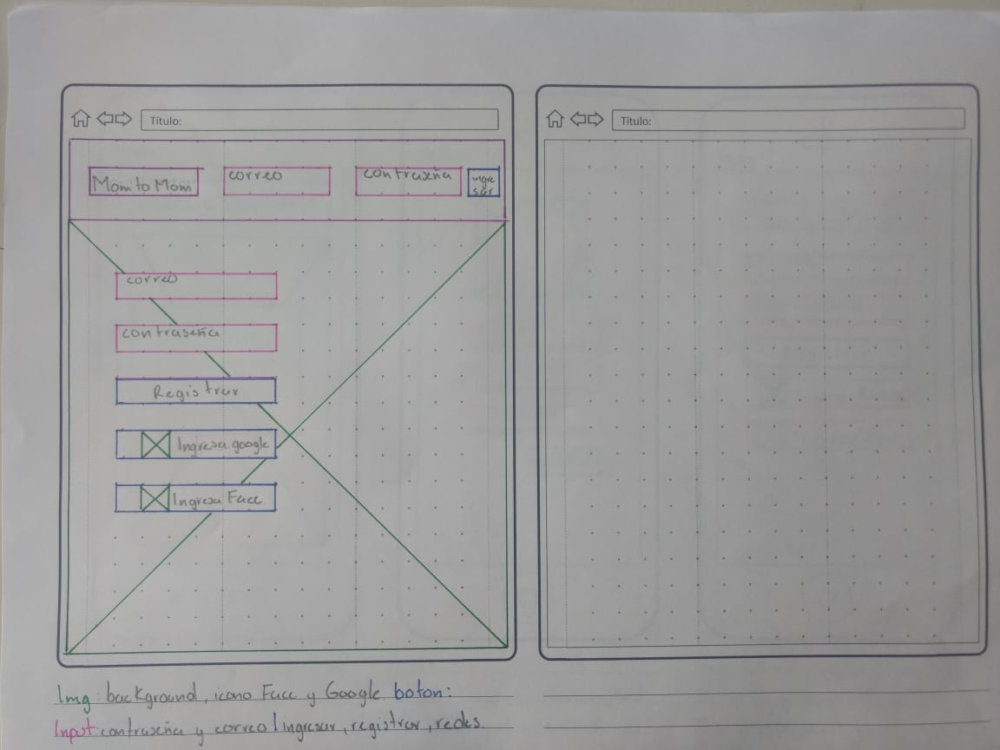

#### **Prototipo para pantalla de movil:** 

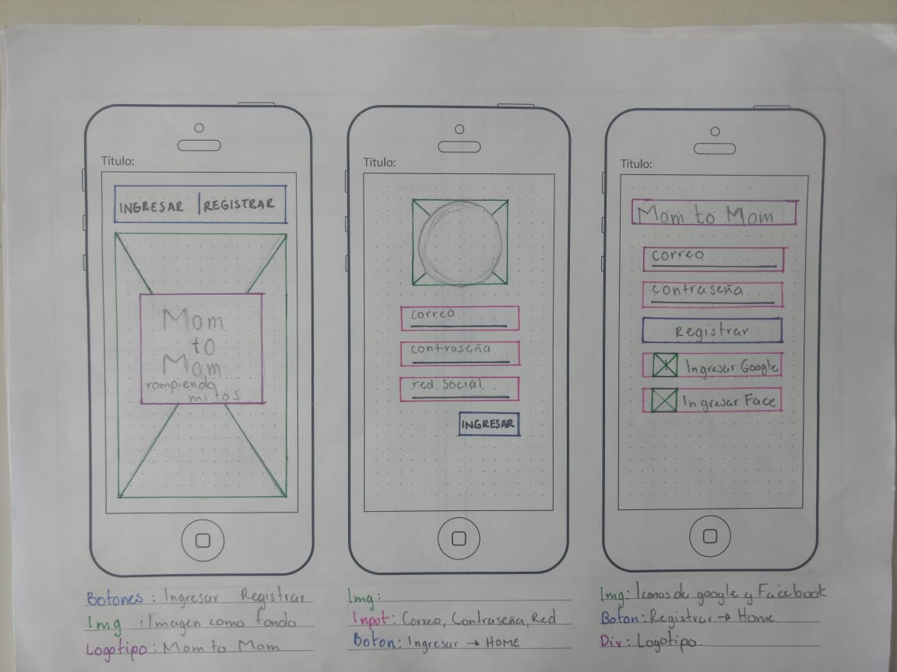

#### **Prototipo login:** 

https://www.figma.com/file/SacBbSk4Wst6RTG1jvTng0G3/Untitled?node-id=20%3A2

### **User testing:** 

### **Argumentacion de Visual Desing:** 

### **Referencias bibliograficas:** 

https://espanol.babycenter.com/thread/92307/mitos-y-leyendas-?startIndex=10
https://www.mibebeyyo.com/
https://www.bbmundo.com/bebes/seis-doce/a-que-edad-debo-revisar-la-vista-a-mi-hijo/
http://www.abcdelbebe.com/embarazo/primer-trimestre
https://wwwhatsnew.com/wp-content/uploads/2010/06/Usos_madres_padres_internet_paraBebes.pdf
http://www.cunamas.gob.pe/?p=6417

