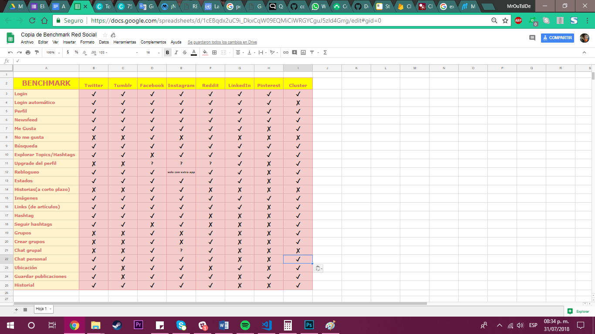

# Cluster

---


## Una Red Social para mujeres STEM

## Preámbulo

Actualmente en el mundo del STEM las mujeres siguen siendo una minoría, por ejemplo, constituyen sólo un 30% de los investigadores en el mundo. Sin ir más lejos, las mujeres en México ocupan el 1% en las carreras de ingenierías en cómputo.

Para ayudar a acortar esta gran brecha, es necesario hacer una comunidad para estas. Así encontrarán de una manera rápida y al alcance de su celular apoyo entre ellas, discusiones constructivas e influenciar positivamente a las jóvenes que estén pensando desarrollarse en este mundo, pero que por ciertas circunstancias aún no toman ese camino.

## Introducción

En la actualidad las redes sociales se han convertido en una herramienta en la vida diaria de los mexicanos. Según el estudio Sobre los Hábitos de los Usuarios de Internet en México, realizado por la Asociación de Internet, el 95% de los mexicanos con acceso a internet cuentan con un perfil de Facebook; en cuestión de número de usuarios este estudio nos arroja que las mujeres ocupan el primer lugar siendo el 51%.

Las redes sociales también sirven como herramienta para la difusión de las ciencia, la cultura y la tecnología y también para hacer comunidad con personas de todo el mundo.

## Objetivos

Por esta razón nació (nombre de la red social), una red social que unirá a estas mujeres en una gran comunidad. Donde podrán compartir los avances de sus proyectos, consultar dudas con otras compañeras alrededor del mundo, compartir experiencias y hacer una red de apoyo.

La forma en que (nombre de la red social) retribuirá a los inversionistas será mediante adds que aparecerán de manera orgánica dentro del feed de la usuaria y venderemos la base de datos al mejor postor.

## Historias de Usuarias

| Historia de Usuaria   Nr.1|
|---|
| Fecha:  09/07/2018   |
| Nombre de la Usuaria:  Diana Perez Pineda  |
|  Edad: 36 años  |
| Título:  Compartir   |
|  Como bióloga quiero compartir mis más recientes descubrimientos para que más mujeres biólogas conozcan sobre mi investigación y puedan contribuir o usarla como punto de partida. |

| Historia de Usuaria  Nr.2|
|---|
| Fecha:  16/07/2018   |
| Nombre de la Usuaria:  Juana Torres Medina  |
| Edad: 29 años  |
| Título:  Busqueda de vacantes  |
| Acabo de recibir mi pasantía y estoy en busqueda de un empleo encaminado en mi área de especialización. Como mujer es dificil encontrar un trabajo bien pagado y en lo que una estudió. Más, tratandose del ámbito de las ciencias. |

| Historia de Usuaria  Nr.3|
|---|
| Fecha:  14/07/2018   |
| Nombre de la Usuaria:  Susana Lafon Dávila  |
| Edad: 20 años  |
| Título:  Orientacion Vocacional  |
| No se que quiero estudiar, pero en esta Red Social no solo puedo conocer a otras chicas, si no, tambièn me pueden compartir experiencias y asesorar. |

| Historia de Usuaria  Nr.4|
|---|
| Fecha:  11/07/2018   |
| Nombre de la Usuaria:  Reneè Castrejòn  |
| Edad: 24 años  |
| Título:  Curiosidad e interès  |
| Desde niña me ha gustado la tecnologìa y aunque no trabaje ni estudie algo relacionado, me gusta mucho explorar el foro y aprender nuevas cosas. |

## Encuestas

**Preguntas de la encuesta:


1. ¿Qué edad tienes?
2. ¿Qué tipo de redes sociales usas y cuál es tu favorita? (Respuestas múltiples)
3. ¿Con qué frecuencia usas alguna Red Social?
4. ¿Qué es lo que mas amas de tu Red Social preferida?
5. Tienes redes sociales preferidas pero hay partes del diseño que ODIAS, ¿cuáles son?
6. ¿Te interesa alguno de estas disciplinas?
7. ¿Estudias o trabajas en alguno de estos campos?
8. ¿Crees que debería de haber más mujeres interesadas/estudiando/trabajando las disciplinas CTIM(Ciencias, Tecnología, Ingeniería y Matemáticas)?
9. ¿Qué tan interesada estarías en una red social dedicada a estas disciplinas?
10. ¿Con qué frecuencia usarías una Red Social dedicada a mujeres del área STEM?


**Resultados:

## Benchmark

Para poder diseñar una red social que satisfaga a las usuarias al màximo
se analizaron productos similiares y se compararon en base a sus procesos y funcionalidades.


## Mockups


## Maquetado

## Prototipo de alta fidelidad

## Boilerplate

```text
./
│
└── src
│   └── css
│   │   └── main.css
|   └── images
|   |   ├── benchmark.png
|   |   ├── encuesta1.png
|   |   ├── funcionalidad1.png
|   |   ├── funcionalidad2.png
|   |   ├── icon1.png
|   |   ├── mockup1.png
|   |   └── mockup2.jpeg
|   └──js
|   |   ├── app.js
|   |   └── index.js
│   └── views
│   |   └── view1.html
│   ├── app.html
│   └── index.html
│       ├── main.js
│       └── data.js
└── test
|   ├── data.spec.js
|   ├── headless.js
|   └── index.html
├── .editorconfig
├── .eslintrc
├── .gitignore
├── package.json
└── README.md

```

## Checklist

### General

* [ ] Producto final sigue los lineamientos del diseño.

### `README.md`

* [x] Definición del producto.
* [x] Benchamark de las principales redes sociales.
* [ ] Resumen de entrevistas con usuarios.
* [ ] Link/screenshots prototipo de alta fidelidad.
* [ ] Conclusiones de pruebas del prototipo con usuarios.
* [ ] Conclusiones de pruebas con el producto en HTML.

### Pruebas / tests

* [ ] Tests unitarios cubren un mínimo del 70% de statements, functions, lines,
  y branches.
* [ ] Pasa tests (y linters) (`yarn test`).

### Creación de cuenta (sign up)

* [x] Permite crear cuenta.
* [x] Valida email.
* [ ] Valida password.
* [ ] Muestra mensajes de error.

### Inicio de sesión (sign in)

* [x] Permite iniciar sesión.
* [x] Valida email.
* [ ] Valida password.
* [ ] Muestra mensajes de error.

### Muro (wall/feed)

* [x] Muestra _muro_.
* [x] Permite publicar nuevos posts.
* [x] Permite eliminar posts.
* [x] Pide confirmación antes de borrar posts.
* [ ] Permite editar posts (in place).
* [ ] Permite filtrar posts por público/amigos.
* [ ] Permite marcar posts como _gustados_ (like).
