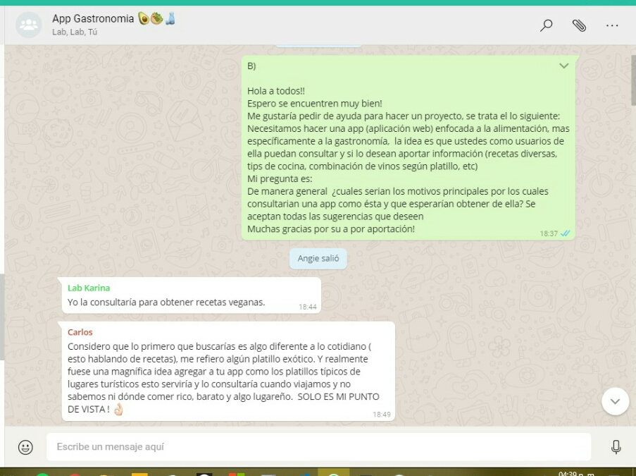
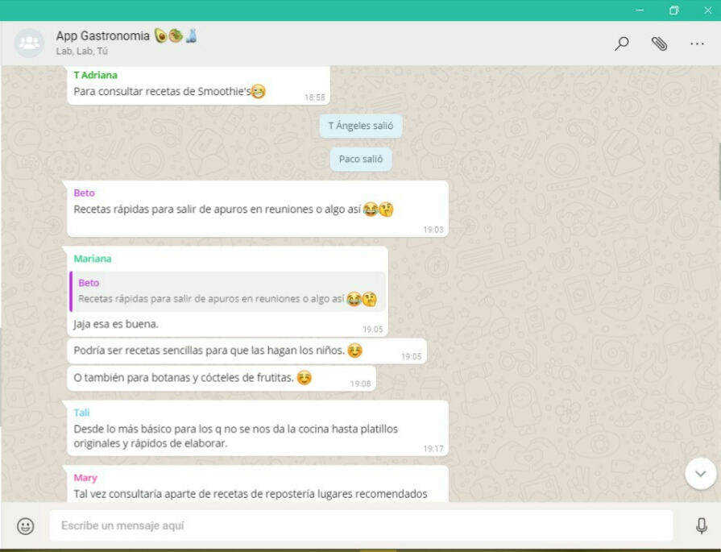
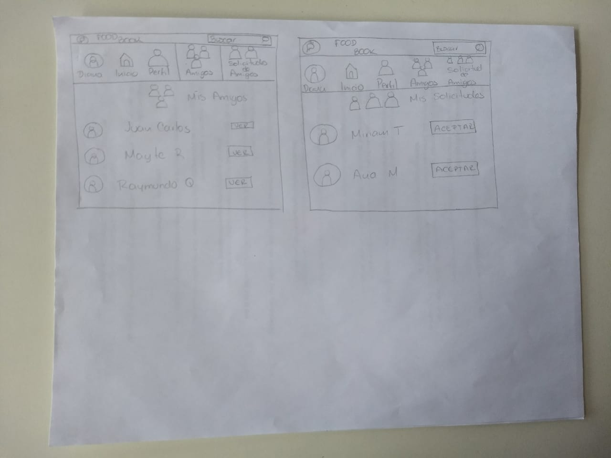

# UX

**¿Qué es una red social?**

Para poder entender lo que nuestro cliente solicita y con ello empatar nuestras ideas sobre el producto, debemos aterrizar el concepto y los elementos de una red social. Hoy en día todos utilizamos distintas redes sociales: Instagram, Facebook, twitter, entre las más conocidas. De éstas podemos observar que son servicios centrados en los intereses del usuario y sus relaciones personales. 

Una red social nos permite crear un perfil (público o privado)  para poder ser identificados por otros. Nos permiten compartir información de nuestro interés, publicar información en nuestro perfil, publicar en perfiles de nuestros conocidos; evaluar publicaciones y ser evaluados. Permiten  la posibilidad de interacción con otra persona, fomentan y fortalecen las relaciones entre usuarios creando comunidades con intereses similares o relaciones interpersonales en común.

En las ciudades como la CDMX es bastante común encontrar que las Redes Sociales se han convertido en algo constante, cotidiano e indispensable para la mayoría de las  personas. Gracias a éstas nos es posible encontrar un espacio creativo de convivencia virtual que nos une a nuestros seres queridos y a las personas con nuestros mismos intereses. 

**Problemática**

Es bien sabido que en México es uno de los países con más problemas de obesidad. Según un artículo de la *BBC*, La Organización para la Cooperación y el Desarrollo Económicos (OCDE) realizó un estudio en 2015, se encontró que Estados Unidos es el país que encabeza la lista, con el 38,2% de la población mayor de 15 años con obesidad mientras México ocupa el segundo lugar con el 32,4% de la población y Nueva Zelanda con el 30,7%. Se estima que a largo plazo los niveles de obesidad aumentarán para el 2030, como también ocurre en otros países como Estados Unidos, Inglaterra, Canadá, Francia y España.

Para tener una mejor idea de la problemática realizamos un sondeo para delimitarla y entender posibles soluciones que el usuario emplearía.

 

Derivado de esto consideramos conveniente realizar una serie de preguntas en torno a estos resultados, los cuales arrojaron lo siguiente en este
[Cuestionario](https://docs.google.com/forms/d/1y8orWsIOjkrOVd1Yfd35Uo6qiF26XfBipm9aP9Tksmw/edit#responses)

Lo más destacado de ésta encuesta, se mencionan en los siguientes puntos:

* Nuestros encuestados están en un rango de edad de entre los  24 a los 35 años.
* Trabajan y/o  estudian tiempo completo.
* Consideran que tienen problemas para alimentarse sanamente
* No encuentran opciones saludables, cuentan con poco tiempo para la elaboración de sus alimentos, cuentan con poco presupuesto, no quieren invertir tanto tiempo en la preparación y no les son apetecibles las opciones sanas.
* Están conscientes de la importancia de los buenos hábitos de la alimentación y su solución, sin embargo viendo los resultados de los puntos anteriores carecen de una buena organización.

 A pesar de que la mayoría lleva su comida al trabajo o escuela, consideran que no son las mejores opciones y esto es porque no conocen más variantes a la hora de la preparación. 

Por ello pensamos en crear una red social que brinde un espacio para personas que busquen un cambio significativo en su alimentación de la manera más creativa, atractiva y sencilla.

Nos dimos a la tarea de  entender las motivaciones y  propósitos de nuestros usuarios para brindar en conjunto con ellos herramientas que puedan ayudarlos a sustentar buenas prácticas alimenticias haciéndolos partícipes en este proceso. Con esto pretendemos dar apoyo a los usuarios que buscan mejorar su calidad de vida pensando en el contexto en el que se desenvuelven día a día.

**¿Quiénes son los principales usuarios ?**

Nuestros principales usuarios son mujeres y hombres de entre  los 25 y 30 años que trabajan y/o estudian. Están fuera de casa todo el día, esto implica para ellos no tener tiempo para preparar sus alimentos.

Intuimos que como sociedad mexicana, las madres o parejas son quienes se encargan de prepararles estos alimentos y por ello pensamos en nuestro target final: *"las personas que quieren hacerse cargo de su alimentación y ya no depender de alguien más para su elaboración".*

Las largas jornadas de trabajo sentados frente a un computador o en un salón de clases forman parte de su cotidianeidad,  así como caminos que se complican aún más por el tráfico que deben recorrer por la ciudad al salir de casa para ir a la oficina y viceversa; distintas actividades que van excluyendo el cuidado personal y particularmente, la alimentación y la falta de actividad física, esto conlleva a un desgaste dejándolos sin motivación para realizar actividades extras.

**¿Cuáles son los objetivos de estos usuarios en relación con el producto?**
 
Tener una fuente de consulta, aportar a esa fuente y ser un participante activo dentro de la misma, encontrar motivación en una comunidad que tiene el mismo fin de independizarse en cuanto a su hábitos alimenticios y conocer gente dentro de esa misma comunidad.

Así mismo planteamos los objetivos de los usuarios con respecto al producto utilizando las historais de usuario.

* Yo usuari@ quiero poder registrarme con facebook o google en una nueva red social 
* Yo como usuari@ logueado quiero poder hacer publicaciones para comunicarme con personas como yo que busquen una mejora en su alimentación. 
* Yo como usuari@ quiero poder contribuir y recibir  tips o recetas, videos y fotos, para ayudarnos a mejorar nuestra alimentación, lo cual nos brindará motivación y una mejor calidad de vida
* Yo como usuari@ quiero poder dar  y recibir like a las publicaciones de mis amigos.
* Yo como usuari@ quiero poder ver cuántos  likes/Estrella (o similar) tiene una publicación.
* Yo usuari@ quiero poder eliminar un post/publicación específico.
* Yo usuari@ quiero darle click en el botón editar, cambiar el texto, imagen, post e imagen, o lo que contenga la publicación. 
* Yo usuari@ quiero que al recargar la página pueda ver los textos editados y publicaciones anteriores (persistencia).
* Yo usuari@ quiero poder agregar nuevos amigos
* Yo usuari@ quiero poder aceptar solicitudes de amigos
* Yo usuari@ quiero poder eliminar amigos
* Yo usuari@ quiero poder Debe poder filtrar los posts sólo para mis amigos y para todo público.
* Yo usuari@ quiero poder publicar solo para mis amigos
* Yo usuari@ quiero poder poder publicar públicamente, visible para todos los usuarios de la red social.
* Yo usuari@ quiero poder enviar mensajes privados a mis amigos.

**Conclusión:**

   Estos resultados nos hicieron ver la problemática real, la cual nos dice que muchos de estos encuestados son personas que dependen de alguien más para su alimentación. Notamos que no hay coherencia en sus respuestas al decir que no tienen tiempo para preparar alimentos, sin embargo se llevan comida, la pregunta aquí es: *¿quién les prepara esa comida?* 
  
# Ideación

**Prototipado**

A continuación mostraremos el primer sketch, pensando primero en el dispositivo móvil, pues es más cómodo para el usuario accesar a través de éste a una app.

 

Version Desktop

### Fundamento para el protrotipado

La idea principal de nuestra red social no es sólo ofrecer, como muchas, recetas saludable, si bien se basará en esto, lo principal es crear y fomentar la autonomía de la alimentación de todo aquel que ya haya tomado este primer paso. Nuestra comunidad ayudrá con ese gran paso ofreciendo consejos e ideas de usuaros que estuvieron es esa misma situación y cómo salieron de ello.

Teniendo en cuanta que la comida entra por lo ojos, sabemos que la toma de decisiones en cuanto a colores e imagenes es primordial para motivar al usuario, el uso de lenguaje poco técnico en las recetas y tips, es de las mayores preocupaciones entre los usuarios al igual que los utensilios de cocina. El color es capaz de estimular o deprimir, puede crear alegría o tristeza. Así mismo, determinados colores despiertan actitudes activas o por el contrario pasivas. Con colores se favorecen sensaciones térmicas de frío o de calor, y también podemos tener impresiones de orden o desorden.

Para nuestra red social hemos decidido incorporar el color naranja en nuestro logotipo, este es asociado mayormente a alimentos cítricos que hacen de referencia una vida saludable. Este color tiene el poder de activar nuestro organismo, lo que ocasiona la necesidad repentina de comer y un creciente hambre, mientras nuestro cerebro está siendo influenciado mentalmente para esto.

En el campo de Marketing:

* Significa agresión
* Crea un llamado a la acción: Compre, Venda, Suscríbase
* Presente en compradores impulsivos
* Representa una marca amigable, alegre y confiable

También optamos por un contraste con un color verde que representa:

Verde
Personalidad/Emociones

* Asociado con salud y tranquilidad
* Simboliza el dinero
* Denota naturaleza
* Alivia la depresión
* Es utilizado en gafas de visión nocturna porque el ojo humano es más sensible y capaz de discernir los contrastes y las sombras
* Representa un nuevo crecimiento

Marketing

* Usado para relajar en las tiendas
* Asociado con riqueza
* Ha sido un símbolo de fertilidad

   
   
   

Hacer un  prototipo de alta fidelidad. FFIGMAAAAA
Testear el prototipo con usuarios. --------- Hasta que tengamos el figma
Asegurarte de que la implementación en código siga los lineamientos del diseño. -------------------------- 
Hacer sesiones de testing con el producto en HTML. -----------------------
Esta vez te pedimos que los ítems de tu Backlog de Producto estén escritos como Historias de Usuario. Esta es una técnica muy simple que te ayudará a: (Hacerlo hoy)
Organizar el trabajo en función del valor que le aporta al usuario.
Poder publicar partes completas y utilizables del producto al final del sprint.
Que el equipo trabaje de manera multidisciplinaria de manera natural.
) Definición del producto
En el README.md cómo conociste el mercado de las redes sociales, cómo descubriste las necesidades de los usuarios, cómo llegaste  la definición final de tu producto. Es importante que detalles:

 

PUNTOS QUE FALTAN DESARROLLAR
Cuáles son las principales funcionalidades del producto y cuál es su prioridad
Cómo verificaste que el producto les está resolviendo sus problemas
Cómo te asegurarás que estos usuarios usen este producto
