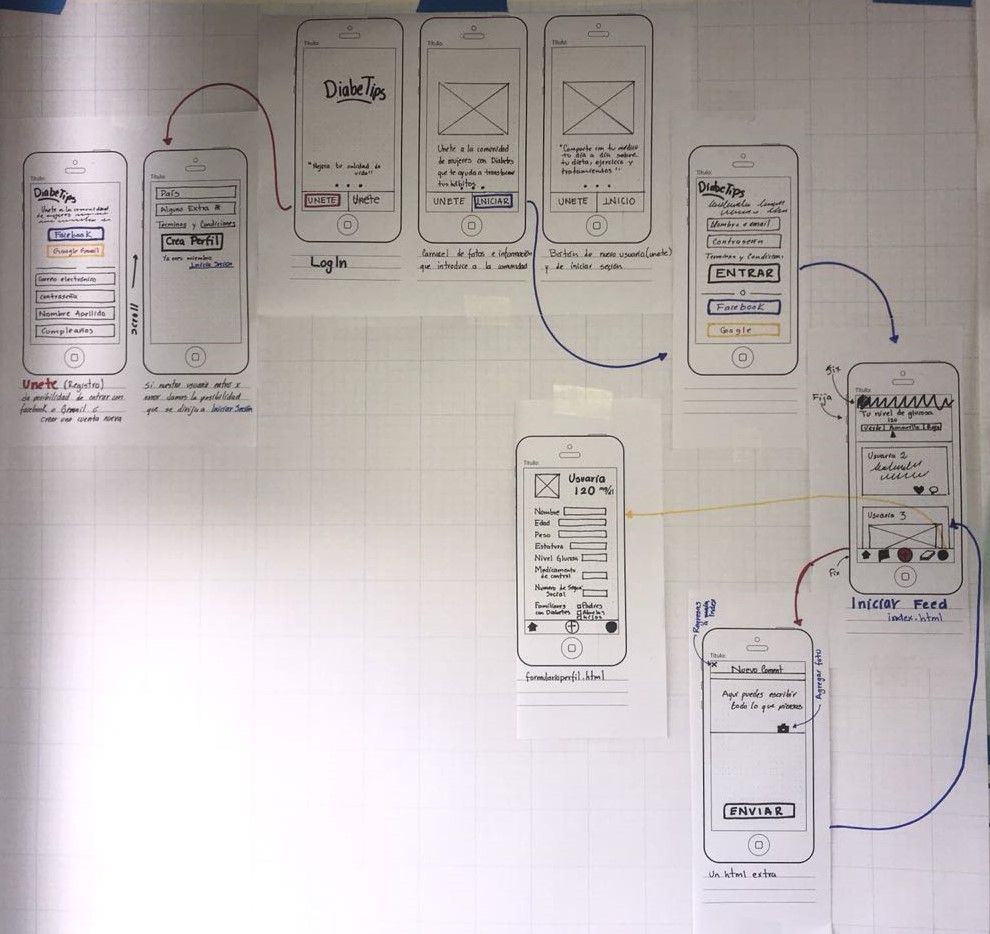
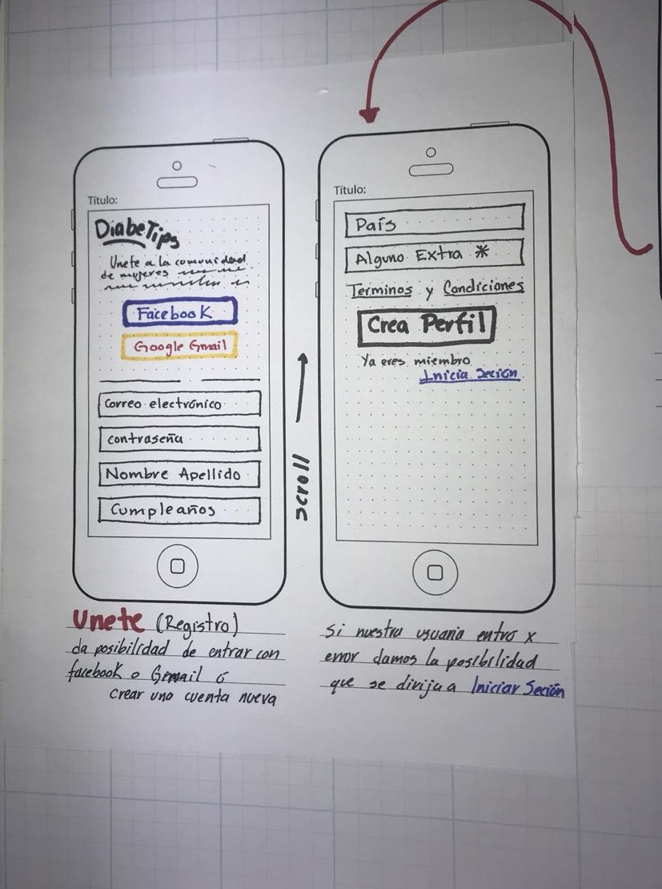
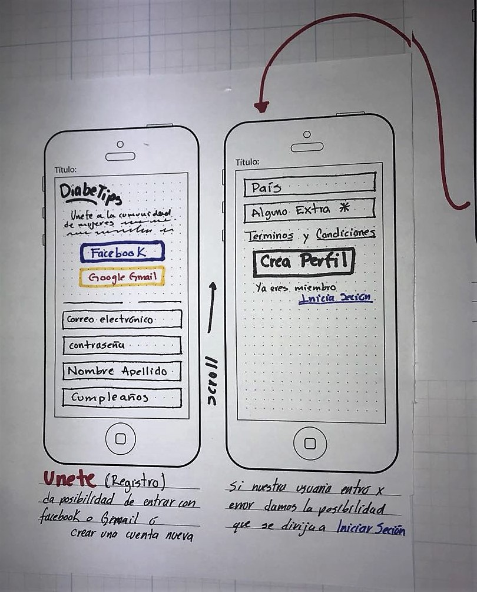
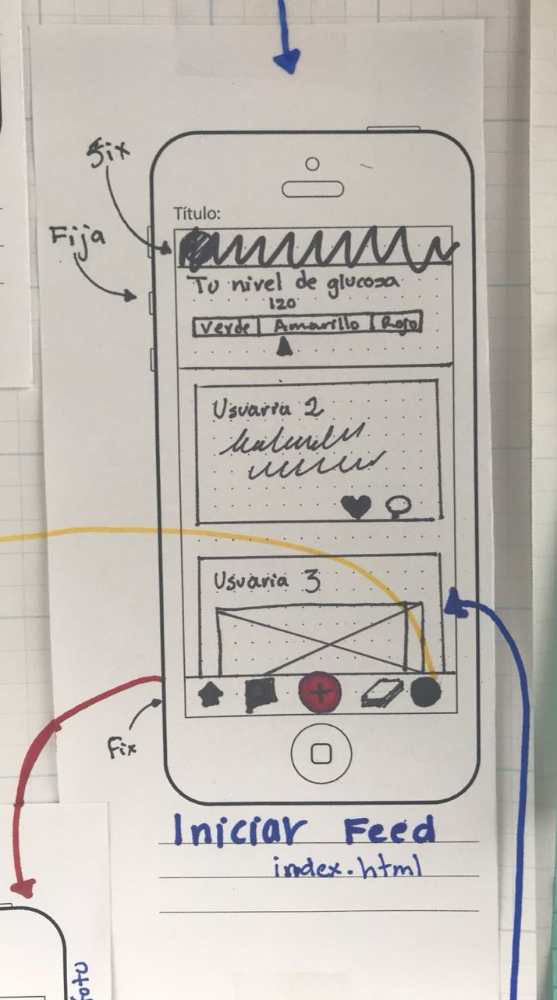

## Sketching de Diseño Ideal
Mobie first

## Benchmark (externo)
"DiabeTips"
Mejora tu calidad de vida y la de los demas.
Somos una comunidad de personas con diabetes que desean llevar una mejor calidad de vida-------

DiabeTips es una Red Social principalmente para mujeres con diabetes, dentro de ella podrán interactuar, compartir recetas saludables, crear eventos, puntuar a los mejores consejos y donar insumos para el cuidado de esta enfermedad.

Al registrarse en esta Red Social contaran con un perfil que tendra como datos principales Nombre, edad, Tipo de Diabetes que padecen, contacto y su ubicación.

## Principales competidores de "DiabeTips"

- Aplicaciones para el control de la Diabetes

En nuestra investigación encontramos a varios competidores, todos cuentan con la misma funcionalidad por ejemplo:

- Son un diario de control de los niveles de Glucosa
- Hacen recomendaciones de cuidados y dosis de insulina que deben de ingerir de acuerdo a la información obtenida
- Dan guías sobre las etapas de la Diabetes

Las aplicaciones que se encuentran actualmente mejor rankeadas son  Diabetes-Diario de Glucosa, Diabetes:M y My sugr: App diario de diabetes.

- Páginas y Grupos de Facebook

En este sector solo nos encontramos con la página de la Federación Mexicana de Diabetes, escasas páginas de fundaciones y grupos que van desde temas como dieta, compra-venta de insumos y diabetes gestacional.

En facebook nos dimos a la tarea de buscar eventos en la CDMX y nos encontramos con lo escasos que son incluso a nivel nacional, la mayoria estaban ubicados en el extranjero.

**Datos demograficos**

## Análisis y Mejoras con nuestra red social

- Nuestra comunidad será unicamente para personas con Diabetes y expertos en el tema (Médicos).
- Tendrán un perfil que será visible para la comunidad y los expertos.
- Dentro de su perfil podrán llevar un registro con sus síntomas y niveles de glucosa diarios.
- Podrán compartir el registro de su perfil con su doctor.
- Van a interactuar entre ellas, haciendo recomendaciones de alimentos, ejercicios, eventos de ayuda o prevención, donar insumos para su cuidado e incluso rankear a los mejores consejos.
- Cada mes lanzaremos un reto saludable.

## Análisis Argumentativo de la elección de la Red Social.

Se crea esta Red Social debido al indice de personas con diabetes que hay en México, en 2017 se contabilizó que el 15.8% de la población total padece de esta enfermedad siguiendo paises como Turquía con 12.8%, EU 10.8%, y Brasil 10.8%.

Como datos importantes encontramos que las personas con esta enfermedad tienen entre 20 y 79 años de edad, la Federación Mexicana de Diabetes evalua que hay 33 millones de adultos que tienen diabetes pero no han sido diagnosticados. México dobla el promedio de 7% que tienen los demás países de la Organización para la Cooperación y el Desarrollo Económicos (OCDE).

Actualmente nuestro país es el primer lugar en obesidad con el 33% de la población, mientras el limite es de 19%.

Nuestra Red Social busca concientizar a la población sobre el cuidado y tratamiento de la Diabetes a traves de apoyo comunitario ya que la mortandad en México esta directamente relacionada con la nutrición deficiente.

## Target, argumentación del proyecto (negocio y usuario)

"Diabetips" esta pensansado en mujeres de 20 a 45 años, ya que son mujeres en edad reproductiva y tienen mas riesgo de sufrir este padecimiento, incluso la Federación Internacional de Diabetes nos dice puede haber descenso de fertilidad, y mayor riesgo de complicaciones del embarazo (Diabetes Gestacional).

En México la diabetes es una enfermedad que ha alcanzado proporciones epidémicas y su impacto seguirá creciendo en las siguientes décadas, principalmente por el aumento de la obesidad, actualmente en nuestro país el 33% de la población total tiene obesidad, el problema no termina ahí, sino que deriva en enfermedades que de no tratarse a tiempo o correctamente pueden causar la muerte.

La tasa de nuevos casos de diabetes y fallecimientos asociados a esta enfermad aumentó en los últimos tres años, al pasar de 401 casos a 487 por cada 100 mil habitantes (informe realizado por 'Panorama de la Salud 2017" de la OCDE ).

En conclusión

* La principal víctima, estadísticamente, por este padecimiento son las mujeres. En la región americana, la diabetes afecta tanto a mujeres (8.6%) como a hombres (8,4%). Sin embargo, las mujeres (29.6%) presentan tasas más altas de obesidad que ellos (24%)

* La diabetes no es una sentencia de muerte, se puede vivir una larga vida, sin embargo obliga a las personas a adoptar hábitos más saludables pero con un costo elevado por los medicamentos, complicaciones y cambio de hábitos alimenticios.

* El Instituto Mexicano para la Competitividad (IMCO), señala que los costos sociales de la diabetes asociada al sobrepeso y la obesidad en el país ascienden a más de 85,000 millones de pesos al año.

## "Diabetips"

Esta red social creará una comunidad, en la que sus usuarias podrán interactuar y compartir habitos alimenticios, sus experiencias con esta enfermedad, comentarios de aliento y tips para tener una vida más saludable. Un plus para ellas es poder tener conectarse desde son su perfil de Facebook o correo de Gmail, incluso ellas podrán guardar un perfil con los datos que generalmente son solicitados por su médico a la hora de asistir a una consulta como son: edad, peso, nivel de glucosa, medicamentos de control, número de seguridad social y sus antecedentes familiares.

Es un hecho que tener este padecimiento significa gastar más, por lo que con esta Red social buscaremos descuentos y patrocinios con las empresas que estan dedicadas a la comercialización de medicamentos,  incluso en un futuro buscar hacer un convenio con empresas relacionadas a la distribución de alimentos, queremos incitar a nuestras usuarias a llevar una mejor alimentación para el control de su enfermedad.

Consultamos a expertos en el tema y coinciden en que las mujeres tienen más apertura a cambiar sus hábitos alimenticios, hacer actividad física y llevar un control de sus medicamentos a diferencia de los hombres que al enfrentarse a ciertas "restricciones" entran en negación.

Las mujeres en México tienen un rol muy fuerte, ellas son las líderes del hogar por lo que buscamos ayudar tanto a ellas con el control de su enfermedad y a sus familias promoviendo el cuidado de la salud para todos los integrantes, queremos que las usuarias sean embajadoras de los buenos hábitos no sólo para vivir bien con la enfermadad sino para prevenirla en quienes aún no la padecen.

## Historia de Usuario

Yo como mujer diabética de 27 años, trabajadora y dedicada a mi familia, quiero una aplicacón que me permita interactuar con más mujeres que padezcan esta enfermedad, quiero poder compartir mi sentir tanto físico como emocional, recibir consejos de personas que ya llevan tiempo cuidandose, conocer a historias de personas que a pesar de todo llevan una vida feliz, ir al doctor y saltarme esas preguntas que son repetitivas consulta tras consulta, quisiera poder tener un "perfil" que ya tenga todas esas respuestas para poder mostrarlo a mi doctor y hacer más rápido mi paso por el hospital. No quiero que mi familia sufra lo mismo, por lo que quisiera tener toda la información sobre complicaciones o forma de prevenir para hablar con ellos y hacer conciencia de lo que pasará sino se cuidan.

## Formularios aplicados

Durante nuestra investigacion aplicamos diferentes formularios a Expertos en el tema, Mujeres con Diabates y una encuesta para conocer un poco más sobre sus hábitos.

* Resultados de formulario para Expertos

https://docs.google.com/forms/d/1nP3k9PJ8N6f9j1hZzteiIWGFmATQu4fA9IOBdlN74KQ/edit?edit_requested=true#responses
- Son Enfermeros
- Cuentan con 4 años de experiencia en promedio
- El 75% son Mujeres
- Cuentan con dispositivo móvil y la red social que más revisan durante el día es Facebook
- En promedio el 50% de las personas que atienden por día son diabéticos y son mujeres
- Coinciden en que sus pacientes son de mentalidad cerrada ya que no siguen indicaciones ni cambian sus hábitos alimenticios
- Señalan que las mujeres están más al pendiente sobre el cuidado de su enfermedad
- Los pacientes que atienden tienen complicaciones en sus niveles de glucosa, no toman medicamentos y tienen obesidad.
- En caso de complicaciones un diabético gasta alrededor de $3,500.00 pesos mensuales.

* Diabetes en mujeres
https://docs.google.com/forms/d/1nP3k9PJ8N6f9j1hZzteiIWGFmATQu4fA9IOBdlN74KQ/edit?edit_requested=true#responses

* Vida con diabetes (Hábitos) 
https://docs.google.com/forms/d/1-YOlKn4PHrXrH825d1zxUUpsnMJjXNXtVJqEWARr6z4/edit?edit_requested=true#responses
