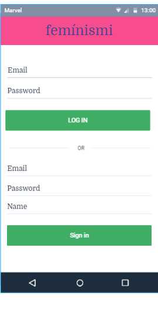
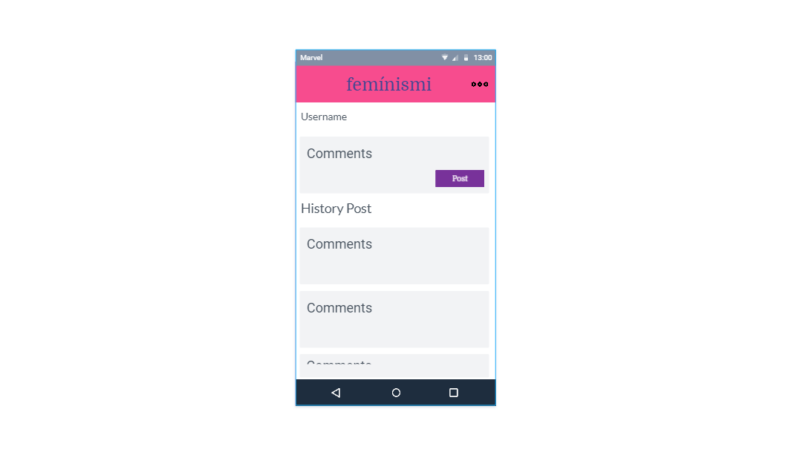
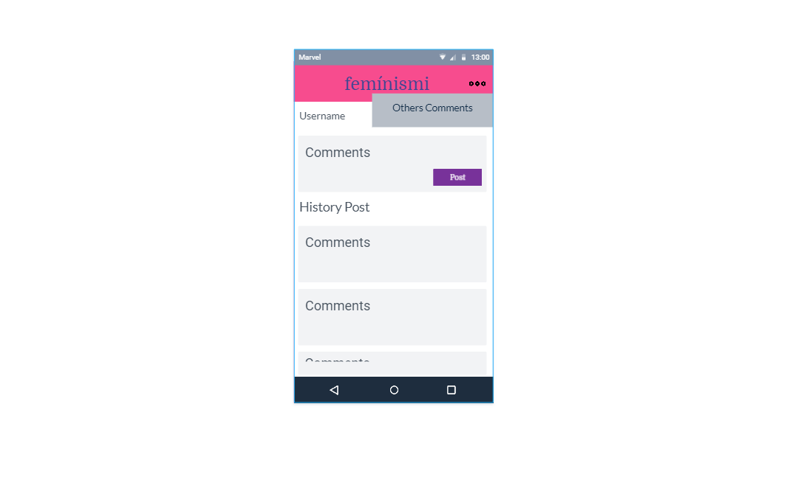
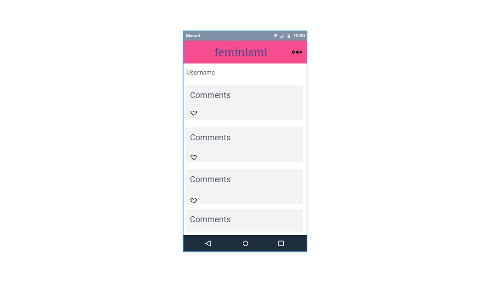
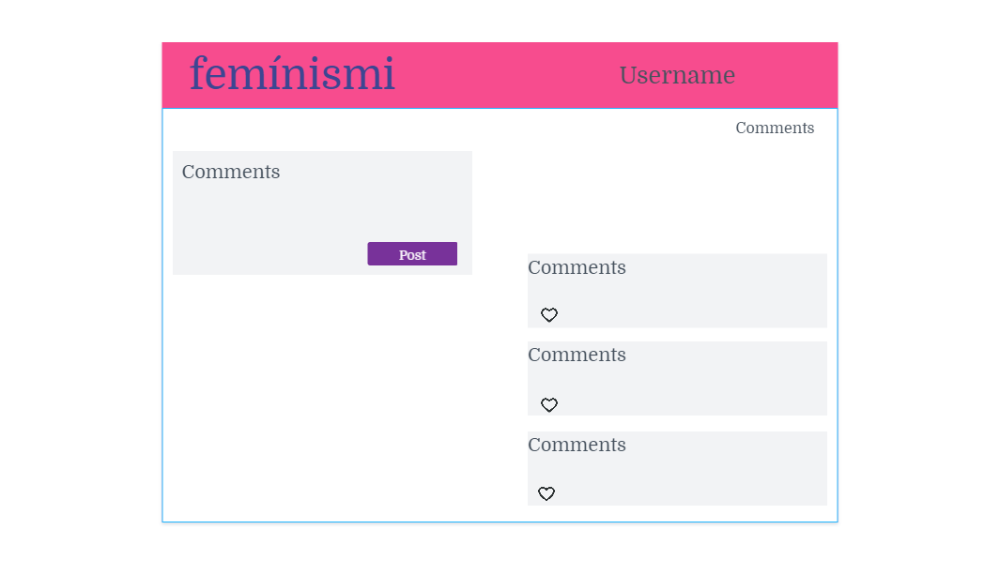
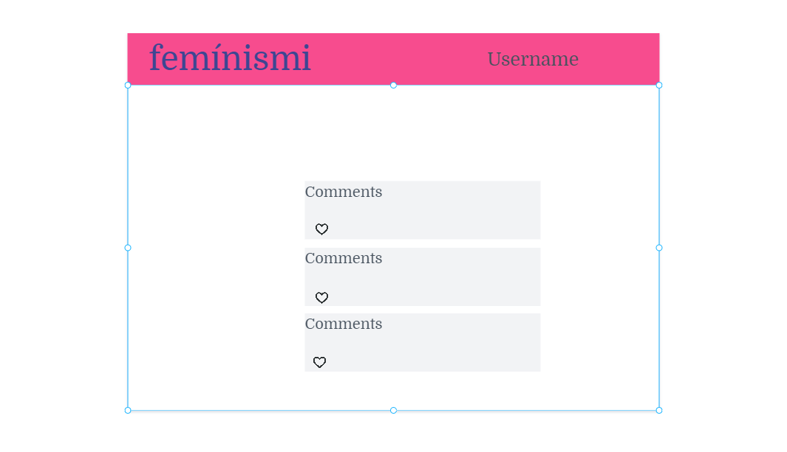

# UX

##Benchmarck

### Prototipo de alta fidelidad
***Sketch para movil***

***Sketch para lap***

##Pseudocodigo

*La interfaz debe permitir lo siguiente*

Crear cuenta de usuario e inicio de sesión
Ingreso con Facebook o Google.
La cuenta de usuario debe ser un correo electrónico válido.
Lo que se escriba en el campo de contraseña debe ser secreto.

    Comportamiento
Al enviarse un formulario de registro o inicio de sesión, debe validarse.
En caso haya errores, el sistema debe mostrar mensajes de error para ayudar al usuario a corregirlos.
La aplicación solo permitirá el acceso a usuarios con cuentas válidas.
Al recargar la aplicación, se debe verificar si el usuario está logueado antes de mostrarle el contenido privado.
Perspectiva de interfase:

*Muro de la red social*
Al apretar el botón de publicar, debe validar que exista contenido en el input.

    Comportamiento
Debe poder publicar un post.
Agregare estrella a una publicación.
Debe pedir una confirmación antes de eliminar un post/publicación.
Al darle click en el botón editar, debe poder cambiar el texto.
Al recargar la página debo de poder ver los textos editados y publicaciones anteriores.
Debe poder publicar públicamente, visible para todos los usuarios de la red social.
Perspectiva de interfaz:

La aplicación NO debe poder dejar hacer publicaciones vacías de ningún tipo.
El usuario debe poder agregar, editar y eliminar contenido de la red social.
El usuario debe poder definir la privacidad de lo que pública.
Al editar contenido, el contenido editado se verá automáticamente, inmediatamente después de guardar.
Al recargar la página se deben poder ver los contenidos editados.