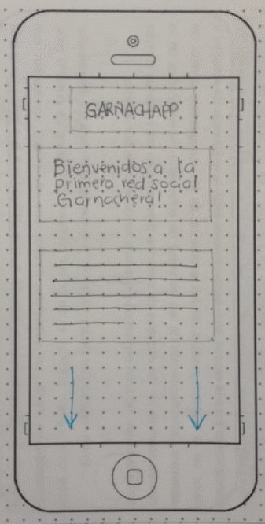

# Creando una Red Social

## Introducción

Tercer proyecto del common core durante el Bootcamp de la 6ta Generación de Laboratoria: **Social Network.**

El reto consiste en crear una WebApp del tipo red social. El giro de este producto será: **Alimentación** y se enfoca en proponer un modelo de negocio que convenza a nuestra entrepreneur/clienta (Sofía) de otorgar financiamiento y así continuar con el desarrollo de la plataforma. 

El producto debe representar una marca, facilitar su desarrollo (branding) para permitir su escalabilidad geográfica y así lograr monetizar la interfaz a mediano plazo (1 año) y principalmente, conseguir impactar en el mercado.
La interfaz se caracterizará por ser amigable, útil y eficaz.
El desarrollo será ágil, durante tres (3) sprints y en trío de programadoras.

## Preámbulo

**[Análisis argumentativo de la elección de la red social]**

Las redes sociales son estructuras sociales; tienen como finalidad principal poner en contacto a las personas, de tal forma que a través de la interfaz se lleve a cabo la comunicación de forma sencilla y rápida, facilitando la interacción entre todos los usuarios, ya sea compartiendo, contactando o facilitando información de interés para el otro usuario.

Fomentan la posibilidad de que los usuarios contactados online, logren un contacto real, del que muy probablemente nacerán nuevas relaciones sociales y/o comerciales gracias a la reducción de distancias y tiempos por lo cual la satisfacción de ciertas necesidades pueden cubrirse rápidamente.

Gracias al contacto *ilimitado* entre los usuarios, las redes sociales son una excelente opción mercadotécnica y la única condición que exige es que ambas partes acepten relacionarse entre sí.

**[Comienza TARGET, argumentación del proyecto]**

La característica más importante y por la que el modelo de negocio se plantea como red social, es por la facilidad de difusión viral de información a través de cada uno de los usuarios que la componen, empleando este método como principal forma de crecimiento en el número de usuarios.
Al permitir el libre flujo de información, las interacciones humanas se detonan y pueden ser almacenadas y/o registradas remotamente. El resultado de esa data puede ser utilizada para fines de lucro e impacto al mercado.
El eje principal del producto radica en identificar a los usuarios a los que estará enfocada la WebApp.

##Desarrollo

### 1) Definición del producto
**GARNACHAPP**

En su primera etapa de desarrollo; **GARNACHAPP** es una red social para residentes de la CDMX, que buscan activamente alternativas para disfrutar la experiencia de comer entre tanta diversidad que la cocina mexicana **informal** ofrece y en dónde el pago en efectivo hace de la toma de decisiones muy ágil y adecuándose al estilo de vida urbano que predomina en la generación **Millennial y Cía.**, hoy en día.
 
Nuestra red social integra los siguientes elementos básicos:

 1. **Social:** Facilidad para iniciar o aumentar las relaciones sociales entre los usuarios.

 2. **Tecnológico:** Se considera el pilar esencial gracias al cual la red social puede ser utilizada, para entender y promover su evolución de manera exponencial por medio del acceso a internet (conexiones de alta velocidad —ADSL, cable, wifi, 3G, 4G…— ) desde cualquier dispositivo electrónico.

 3. **Negocio:** Promover el acercamiento entre los productores informales de alimentos y los usuarios ansiosos de disfrutar diferentes opciones populares, para compartir con sus amigos, pareja, familiares o compañeros de trabajo y al mismo tiempo recibir beneficios como descuentos, en algunos casos hacer reseñas o comentarios que permitan que más personas logren apreciar la variedad de sabores que ofrece la cocina mexicana y que se encuentran alejados de los restaurantes comerciales. 

**[¿Cómo descubriste las necesidades de los usuarios?]**

En *YouTube* podemos encontrar algunos VideoBlogs especializados en el tema, el más popular es [“La ruta de la garnacha”] (https://www.youtube.com/user/vpedoardo). 

En este canal **observamos** la cantidad de reproducciones y de suscripciones que ha generado. Es gracias a este indicador que se determina que una de las necesidades de los usuarios es: ** Variedad.**

Posteriormente, creamos una [encuesta] (https://docs.google.com/forms/d/e/1FAIpQLSe9SvFLKFkTr8BGb24OkiFgWiLfNr9phaJfRdwUEADEK1vV2A/viewform) que permite indagar y confirmar la suposición o dicho de la cultura popular mexicana que dicta: 
**“De la vista nace el amor"**, por lo que determinamos que otra de las necesidades de los usuarios es ver **anticipadamente** el producto alimenticio y determinar, de acuerdo a las valoraciones si acude a consumir y así cubrir la necesidad de **certeza y confiabilidad** lo cual nos permite tener claro el camino: Crear una marca.

 **[¿Cómo llegaste a la definición final de tu producto? PENDIENTE]**

**[Quiénes son los principales usuarios de producto (TARGET)]**

Todas aquellas personas residentes de la **CDMX**, que llevan un estilo de vida urbano, práctico y en constante movimiento, buscando alternativas y que **tienen necesidad de crear contenido continuamente** para atraer la atención de las personas a su alrededor y **compartir experiencias**, a través de fotografías o reseñas.

**[¿Qué problema resuelve el producto para estos usuarios?]**

El producto resolverá principalmente:

*	 La monotonía que muchas personas viven para una actividad tan esencial como alimentarse.

*	Salir de la zona de confort con tu pareja, amigos, familiares y/o compañeros de trabajo.

* Ahorrar dinero sabiendo de antemano que puedes y quieres pagar, ponderando el costo-beneficio de acudir a un establecimiento informal.

*	Necesidad de reconocimiento, al poder compartir nuevos descubrimientos de lugares y poder compartir imágenes. 

**[¿Cuáles son los objetivos de estos usuarios en relación con el producto?]**

Descubrimiento de nuevas opciones para satisfacer la necesidad de alimentación de forma rápida, promueve la economía del productor mexicano y crea nuevas alternativas para fomentar las relaciones entre amigos y/o compartir el descubrimiento de nuevas experiencias. 

**[¿Cuáles son las principales funcionalidades del producto y cuál es su prioridad?]**

Aquí las Historias de Usuario

**[¿Cómo verificaste que el producto les está resolviendo sus problemas?]**

* Testear la interfaz con usuarios y comprobar que la marca genera confiabilidad y lealtad.
**DESARROLLAR BRANDING.**

**[¿Cómo te asegurarás que estos usuarios usen este producto?]**

1.	Test de usabilidad de la interfaz.

2.	Búsqueda de convenios con los productores
*(DescuentosXPublicidad).*

3.	Publicidad por medio de stickers con los productores en sus negocios que envíen un mensaje claro: *“Nos estamos renovando”*, *“Tengo acceso a un perfil público para interactuar socialmente”*, *“Pronto tendré página web, ¡espérala!”*.

### 1.1 Herramientas de análisis de mercado.
**[Idea general: ¿Qué queremos hacer? ¿Por qué y para qué lo queremos hacer? Incluye el problema y la solución que le estamos dando.
Arquetipo de usuario.
Pensar en qué contexto el usuario va a usar la red?
Por qué la usará? Motivaciones del usuario]**

1. Benchmark

2. Encuesta

3. Entrevistas con usuarios

4. Tests de usabilidad.

###1.2 Diseño de la Interfaz de Usuario (prototipo de alta fidelidad).

###1.3 Product Backlog.

**1. Entregables del 1er. Sprint.**

UX Sketching

a) [Ideal] (Pendiente)

b) Versión 1.0 Baja Fidelidad 
                               

               Alta Fidelidad (https://www.figma.com/file/LeDMOc6n08FLECZQ5FFXlf3B/Welcome-Register)               

Prototipo de alta fidelidad
	
a) [Login] (Pendiente)

**2. Entregables del 2do. Sprint**

**3. Entregables del 3er. Sprint**

##Tech
Desarrollado con:

* Javascript (ES6)
* HTML6
* CSS3
* Bootstrap
* Firebase
 
##Detalles de uso y contenido

Aquí la documentación se refiere sólo a [Responsive 
Design]
(https://www.mediaclick.es/blog/diseno-web-responsive-design-y-la-importancia-del-mobile-first/)

La interfaz actual tiene como características:

1. RWD (Responsive Web Design), lo cual permite que la interfaz pueda ser utilizada en distintos tamaños de pantallas: móviles, tablets, desktop.

2. Realizar pruebas unitarias

##Instalación

Para poder utilizar el código, realizar modificaciones o contribuir al proyecto es necesario:

* Tener un editor de textos instalado (Visual Studio Code, Atom, Sublime, etc.)

* Tener instalada una UNIX Shell (En nuestro caso usamos Git Bash)

* Realizar un fork del repositorio

* Clonarlo el fork a la computadora donde se vaya a trabajar

* Tener instalado Node.js

* Instalar las dependencias del proyecto con el ** comando npm install**

##Archivos

[El boilerplate de este proyecto contiene la siguiente estructura de archivos, así como toda la configuración de dependencias y tests:]
AQUÍ SCREENSHOT DE BOILER PLATE (PENDIENTE)

Carpetas  (PENDIENTE)

* data.js 
* main.js 
* index.html (vistas)
* style.css 

##¿Cómo hacer Sign up/Log in en nuestra red social?

Para probar la plataforma actual, se debe contar con acceso a internet e ingresar a la [liga:] (Pendiente)
 
##Colaboradoras

[Aquí las ligas para direccionar a nuestros GitHub]

Palmidia Garay

## Checklist

### General

* [ ] Producto final sigue los lineamientos del diseño.

### `README.md`

* [ ] Definición del producto.
* [ ] Benchamark de las principales redes sociales.
* [ ] Resumen de entrevistas con usuarios.
* [ ] Link/screenshots prototipo de alta fidelidad.
* [ ] Conclusiones de pruebas del prototipo con usuarios.
* [ ] Conclusiones de pruebas con el producto en HTML.

### Pruebas / tests

* [ ] Tests unitarios cubren un mínimo del 70% de statements, functions, lines,
  y branches.
* [ ] Pasa tests (y linters) (`yarn test`).

### Creación de cuenta (sign up)

* [ ] Permite crear cuenta.
* [ ] Valida email.
* [ ] Valida password.
* [ ] Muestra mensajes de error.

### Inicio de sesión (sign in)

* [ ] Permite iniciar sesión.
* [ ] Valida email.
* [ ] Valida password.
* [ ] Muestra mensajes de error.

### Muro (wall/feed)

* [ ] Muestra _muro_.
* [ ] Permite publicar nuevos posts.
* [ ] Permite eliminar posts.
* [ ] Pide confirmación antes de borrar posts.
* [ ] Permite editar posts (in place).
* [ ] Permite filtrar posts por público/amigos.
* [ ] Permite marcar posts como _gustados_ (like).